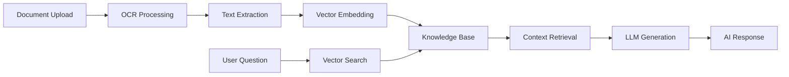
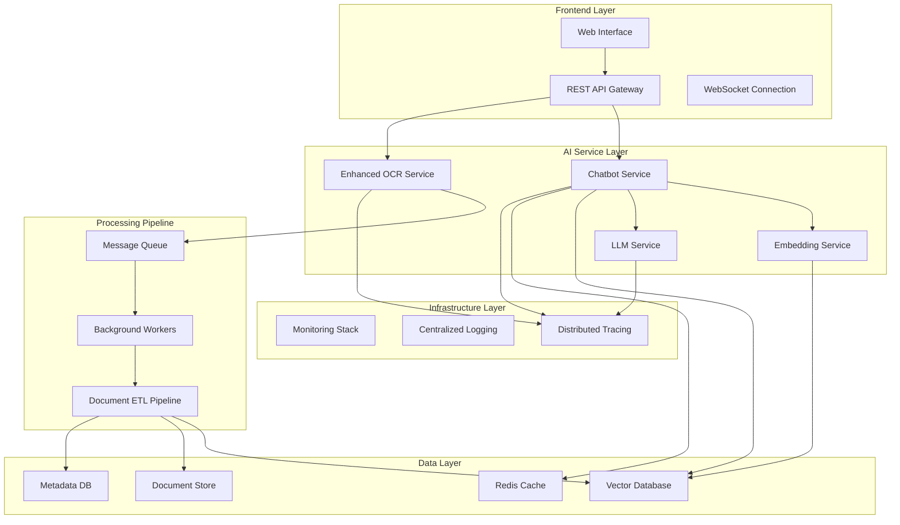
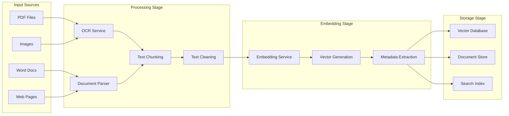

# RAG-Powered Chatbot AI: Complete Architecture & Implementation Guide

**Document Version**: 1.0  
**Created**: August 21, 2025  
**Purpose**: Transform OCR-App into RAG-Powered Chatbot AI System  
**Target Architecture**: Enterprise-Grade AI Chatbot with Document Understanding  

---

## 📋 **Table of Contents**

1. [Executive Summary](#executive-summary)
2. [Current State Analysis](#current-state-analysis) 
3. [Target RAG Architecture](#target-rag-architecture)
4. [System Components Deep Dive](#system-components-deep-dive)
5. [Data Pipeline Design](#data-pipeline-design)
6. [Implementation Roadmap](#implementation-roadmap)
7. [Code Implementation Guide](#code-implementation-guide)
8. [Infrastructure Modifications](#infrastructure-modifications)
9. [Deployment & Scaling Strategy](#deployment--scaling-strategy)
10. [Testing & Validation Framework](#testing--validation-framework)
11. [Monitoring & Observability](#monitoring--observability)
12. [Security & Compliance](#security--compliance)

---

## 🎯 **Executive Summary**

### **Transformation Overview**

We will transform your current OCR application into a sophisticated **RAG (Retrieval-Augmented Generation) powered AI chatbot** that can:

- **Process Documents**: OCR scanning, text extraction, and document understanding
- **Build Knowledge Base**: Vector embeddings, semantic search, and intelligent retrieval
- **Generate Responses**: LLM-powered conversational AI with document-grounded answers
- **Scale Enterprise-Wide**: Multi-tenant, high-availability, production-ready deployment

### **Business Value Proposition**



**Key Capabilities**:
- 📄 **Document Intelligence**: Process PDFs, images, scanned documents
- 🧠 **Contextual AI**: Generate accurate answers from your document corpus
- 🔍 **Semantic Search**: Find relevant information across thousands of documents  
- 💬 **Conversational Interface**: Natural language interaction with your data
- 🔒 **Enterprise Security**: Role-based access, data privacy, audit trails

---

## 🏗️ **Current State Analysis**

### **Existing OCR-App Architecture**

Based on your comprehensive documentation, your current OCR service has:

**✅ Strong Foundation**:
- Production-grade FastAPI application (652 lines)
- Full observability integration (Jaeger tracing, structured logging)
- Kubernetes deployment with Helm charts
- Health check endpoints and error handling
- Image processing with EasyOCR and caching

**✅ Excellent Infrastructure**:
- Complete monitoring stack (Prometheus, Grafana, ELK)
- GitOps deployment with Argo CD
- Infrastructure as Code with Terraform
- Multi-environment support

**🔄 Components to Enhance**:
- **Single-purpose OCR** → **Multi-modal Document AI**
- **Simple text extraction** → **Intelligent document understanding**
- **Basic caching** → **Vector database with semantic search**
- **Static responses** → **Dynamic AI-generated responses**

### **Current System Strengths to Leverage**

```python
# Current OCR App Strengths (helm-charts/ocr-app/main.py)
✅ OpenTelemetry tracing integration
✅ Structured logging with request IDs
✅ Error handling and global exception management
✅ Image hash-based caching system
✅ FastAPI with proper async/await patterns
✅ Health check endpoints (/health, /ready)
✅ Prometheus metrics exposure
✅ Production-ready configuration
```

---

## 🚀 **Target RAG Architecture**

### **High-Level System Architecture**



### **RAG System Components**

#### **1. Document Processing Pipeline**
```
Document Input → OCR/Text Extraction → Chunking → Embedding → Vector Storage
```

#### **2. Query Processing Pipeline** 
```
User Query → Query Understanding → Vector Search → Context Retrieval → LLM Generation → Response
```

#### **3. Conversation Management**
```
Session Management → Context History → Memory → Personalization → Response Delivery
```

---

## 🔧 **System Components Deep Dive**

### **Component 1: Enhanced OCR Service**

**Current**: Simple image OCR processing  
**Target**: Multi-modal document intelligence  

**New Capabilities**:
- **PDF Processing**: Extract text, images, tables, metadata
- **Document Layout Understanding**: Headers, sections, paragraphs  
- **Multi-language Support**: Expanded language detection
- **Table/Form Processing**: Structured data extraction
- **Image Analysis**: Visual content understanding

**Technical Stack**:
```python
# Enhanced OCR Dependencies
import easyocr                 # Current OCR engine
import pypdf2                  # PDF processing  
import pdfplumber             # Advanced PDF parsing
import layoutparser           # Document layout analysis
import transformers           # Document understanding models
import cv2                    # Computer vision
import pandas as pd           # Structured data processing
```

### **Component 2: Vector Database & Embedding Service**

**Purpose**: Semantic search and document retrieval

**Technology Options**:

**Option A: Chroma (Recommended for Development)**
```python
import chromadb
from chromadb.config import Settings

# Lightweight, easy to deploy
client = chromadb.Client(Settings(
    chroma_db_impl="duckdb+parquet",
    persist_directory="./chroma_db"
))
```

**Option B: Weaviate (Recommended for Production)**
```yaml
# Kubernetes deployment
apiVersion: apps/v1
kind: Deployment
metadata:
  name: weaviate
spec:
  template:
    spec:
      containers:
      - name: weaviate
        image: semitechnologies/weaviate:1.21.2
        env:
        - name: AUTHENTICATION_ANONYMOUS_ACCESS_ENABLED
          value: 'false'
        - name: PERSISTENCE_DATA_PATH
          value: '/var/lib/weaviate'
```

**Option C: Pinecone (Cloud-Native)**
```python
import pinecone

pinecone.init(
    api_key=os.getenv("PINECONE_API_KEY"),
    environment=os.getenv("PINECONE_ENVIRONMENT")
)
```

### **Component 3: LLM Integration Service**

**Technology Stack Options**:

**Option A: OpenAI GPT (Recommended for Quick Start)**
```python
from openai import OpenAI

client = OpenAI(api_key=os.getenv("OPENAI_API_KEY"))

def generate_response(query: str, context: str) -> str:
    response = client.chat.completions.create(
        model="gpt-4-turbo-preview",
        messages=[
            {"role": "system", "content": f"Context: {context}"},
            {"role": "user", "content": query}
        ],
        temperature=0.7,
        max_tokens=1500
    )
    return response.choices[0].message.content
```

**Option B: Open-Source LLM (Self-Hosted)**
```python
from transformers import AutoTokenizer, AutoModelForCausalLM
import torch

# Llama 2, Mistral, or Code Llama
model_name = "microsoft/DialoGPT-large"
tokenizer = AutoTokenizer.from_pretrained(model_name)
model = AutoModelForCausalLM.from_pretrained(model_name)

def generate_local_response(query: str, context: str) -> str:
    prompt = f"Context: {context}\nQuestion: {query}\nAnswer:"
    inputs = tokenizer.encode(prompt, return_tensors='pt')
    
    with torch.no_grad():
        outputs = model.generate(
            inputs,
            max_length=500,
            temperature=0.7,
            pad_token_id=tokenizer.eos_token_id
        )
    
    return tokenizer.decode(outputs[0], skip_special_tokens=True)
```

**Option C: Google Vertex AI**
```python
from google.cloud import aiplatform

def generate_vertex_response(query: str, context: str) -> str:
    client = aiplatform.gapic.PredictionServiceClient()
    
    prompt = f"""
    Based on the following context, answer the user's question:
    
    Context: {context}
    
    Question: {query}
    
    Answer:
    """
    
    response = client.predict(
        endpoint=os.getenv("VERTEX_ENDPOINT"),
        instances=[{"prompt": prompt}]
    )
    
    return response.predictions[0]["content"]
```

### **Component 4: Chatbot Service**

**Core Architecture**:
```python
# chatbot_service.py
from fastapi import FastAPI, WebSocket, Depends
from typing import List, Dict, Optional
import uuid
from datetime import datetime

app = FastAPI(
    title="RAG Chatbot Service",
    description="AI-powered document chatbot with retrieval augmentation",
    version="1.0.0"
)

class ConversationManager:
    def __init__(self):
        self.sessions: Dict[str, ConversationSession] = {}
    
    async def create_session(self, user_id: str) -> str:
        session_id = str(uuid.uuid4())
        self.sessions[session_id] = ConversationSession(
            session_id=session_id,
            user_id=user_id,
            created_at=datetime.utcnow()
        )
        return session_id
    
    async def process_message(
        self, 
        session_id: str, 
        message: str
    ) -> ChatResponse:
        session = self.sessions.get(session_id)
        if not session:
            raise HTTPException(404, "Session not found")
        
        # 1. Query understanding
        query_intent = await self.understand_query(message)
        
        # 2. Vector search for relevant documents
        relevant_docs = await self.vector_search(message, limit=5)
        
        # 3. Build context from retrieved documents
        context = await self.build_context(relevant_docs)
        
        # 4. Generate response using LLM
        response = await self.generate_response(message, context)
        
        # 5. Update conversation history
        await session.add_message(message, response)
        
        return ChatResponse(
            response=response,
            sources=relevant_docs,
            session_id=session_id,
            timestamp=datetime.utcnow()
        )
```

---

## 📊 **Data Pipeline Design**

### **Document Ingestion Pipeline**



### **Document Processing Service**

```python
# document_processor.py
from typing import List, Dict, Any
import hashlib
import asyncio
from pathlib import Path

class DocumentProcessor:
    def __init__(
        self,
        embedding_service: EmbeddingService,
        vector_store: VectorStore,
        document_store: DocumentStore
    ):
        self.embedding_service = embedding_service
        self.vector_store = vector_store
        self.document_store = document_store
    
    async def process_document(
        self, 
        file_path: str, 
        user_id: str,
        metadata: Dict[str, Any] = None
    ) -> ProcessingResult:
        """
        Complete document processing pipeline
        """
        try:
            # 1. Document ingestion and validation
            doc_info = await self.ingest_document(file_path, metadata)
            
            # 2. Text extraction (OCR or parsing)
            raw_text = await self.extract_text(file_path, doc_info.file_type)
            
            # 3. Text preprocessing and cleaning
            cleaned_text = await self.preprocess_text(raw_text)
            
            # 4. Document chunking for optimal retrieval
            chunks = await self.chunk_document(
                cleaned_text, 
                chunk_size=1000,
                chunk_overlap=200
            )
            
            # 5. Generate embeddings for each chunk
            embeddings = await self.embedding_service.embed_texts([
                chunk.text for chunk in chunks
            ])
            
            # 6. Store in vector database
            vector_ids = await self.vector_store.add_vectors(
                vectors=embeddings,
                metadata=[{
                    "document_id": doc_info.document_id,
                    "chunk_id": chunk.chunk_id,
                    "user_id": user_id,
                    "text": chunk.text,
                    "chunk_index": chunk.index,
                    **metadata
                } for chunk in chunks]
            )
            
            # 7. Store original document and metadata
            await self.document_store.store_document(
                document_id=doc_info.document_id,
                file_path=file_path,
                user_id=user_id,
                processing_metadata={
                    "chunks_count": len(chunks),
                    "vector_ids": vector_ids,
                    "processing_time": doc_info.processing_time,
                    "file_size": doc_info.file_size
                }
            )
            
            return ProcessingResult(
                document_id=doc_info.document_id,
                status="success",
                chunks_processed=len(chunks),
                vectors_stored=len(vector_ids)
            )
            
        except Exception as e:
            logger.error(f"Document processing failed: {str(e)}")
            return ProcessingResult(
                status="error",
                error_message=str(e)
            )
    
    async def chunk_document(
        self, 
        text: str, 
        chunk_size: int = 1000,
        chunk_overlap: int = 200
    ) -> List[TextChunk]:
        """
        Intelligent document chunking with semantic awareness
        """
        # Sentence-aware chunking
        sentences = self.split_into_sentences(text)
        chunks = []
        current_chunk = ""
        chunk_index = 0
        
        for sentence in sentences:
            if len(current_chunk) + len(sentence) > chunk_size:
                if current_chunk:
                    chunks.append(TextChunk(
                        chunk_id=f"chunk_{chunk_index}",
                        text=current_chunk.strip(),
                        index=chunk_index
                    ))
                    chunk_index += 1
                    
                    # Handle overlap
                    overlap_text = self.get_overlap_text(
                        current_chunk, 
                        chunk_overlap
                    )
                    current_chunk = overlap_text + sentence
                else:
                    current_chunk = sentence
            else:
                current_chunk += " " + sentence
        
        # Add the last chunk
        if current_chunk.strip():
            chunks.append(TextChunk(
                chunk_id=f"chunk_{chunk_index}",
                text=current_chunk.strip(),
                index=chunk_index
            ))
        
        return chunks
```

### **Embedding Service**

```python
# embedding_service.py
from sentence_transformers import SentenceTransformer
import numpy as np
from typing import List
import torch

class EmbeddingService:
    def __init__(self, model_name: str = "all-MiniLM-L6-v2"):
        """
        Initialize embedding service with pre-trained model
        
        Model options:
        - "all-MiniLM-L6-v2": Fast, good performance (384 dim)
        - "all-mpnet-base-v2": Better quality (768 dim)
        - "multi-qa-MiniLM-L6-cos-v1": Optimized for Q&A
        """
        self.model = SentenceTransformer(model_name)
        self.model_name = model_name
        self.embedding_dim = self.model.get_sentence_embedding_dimension()
    
    async def embed_text(self, text: str) -> np.ndarray:
        """Embed single text"""
        return self.model.encode(text, convert_to_numpy=True)
    
    async def embed_texts(self, texts: List[str]) -> List[np.ndarray]:
        """Embed multiple texts efficiently"""
        embeddings = self.model.encode(
            texts, 
            convert_to_numpy=True,
            batch_size=32,
            show_progress_bar=True
        )
        return [emb for emb in embeddings]
    
    async def embed_query(self, query: str) -> np.ndarray:
        """
        Embed query with potential query-specific preprocessing
        """
        # Query preprocessing for better retrieval
        processed_query = self.preprocess_query(query)
        return await self.embed_text(processed_query)
    
    def preprocess_query(self, query: str) -> str:
        """
        Preprocess query to improve retrieval performance
        """
        # Remove question words that don't add semantic meaning
        stop_words = ["what", "how", "where", "when", "why", "who"]
        words = query.lower().split()
        
        # Keep important context words
        filtered_words = [w for w in words if w not in stop_words or len(words) <= 3]
        
        return " ".join(filtered_words) if filtered_words else query
    
    def calculate_similarity(
        self, 
        query_embedding: np.ndarray, 
        document_embeddings: List[np.ndarray],
        method: str = "cosine"
    ) -> List[float]:
        """Calculate similarity scores"""
        if method == "cosine":
            from sklearn.metrics.pairwise import cosine_similarity
            similarities = cosine_similarity(
                query_embedding.reshape(1, -1),
                np.vstack(document_embeddings)
            )[0]
            return similarities.tolist()
        
        elif method == "dot_product":
            similarities = []
            for doc_emb in document_embeddings:
                similarity = np.dot(query_embedding, doc_emb)
                similarities.append(float(similarity))
            return similarities
        
        else:
            raise ValueError(f"Unknown similarity method: {method}")
```

---

## 🛠️ **Implementation Roadmap**

### **Phase 1: Foundation Setup (Week 1-2)**

#### **Step 1.1: Environment Preparation**
```bash
# Create new service directory
mkdir -p helm-charts/rag-chatbot-app
cd helm-charts/rag-chatbot-app

# Initialize Python environment
python -m venv venv
source venv/bin/activate

# Install core dependencies
pip install fastapi==0.115.4
pip install uvicorn==0.32.0
pip install sentence-transformers==2.2.2
pip install chromadb==0.4.15
pip install openai==1.3.5
pip install pypdf2==3.0.1
pip install python-multipart==0.0.6
pip install redis==5.0.1
```

#### **Step 1.2: Project Structure Creation**
```
rag-chatbot-app/
├── main.py                     # FastAPI application entry point
├── requirements.txt            # Python dependencies
├── Dockerfile                  # Container configuration
├── services/
│   ├── __init__.py
│   ├── chatbot_service.py      # Main chatbot logic
│   ├── document_processor.py   # Document processing pipeline
│   ├── embedding_service.py    # Text embedding service
│   ├── vector_store.py         # Vector database interface
│   └── llm_service.py          # LLM integration
├── models/
│   ├── __init__.py
│   ├── chat_models.py          # Pydantic models for chat
│   ├── document_models.py      # Document processing models
│   └── response_models.py      # API response models
├── utils/
│   ├── __init__.py
│   ├── text_processing.py     # Text utilities
│   ├── file_handling.py       # File operations
│   └── monitoring.py          # Observability helpers
├── config/
│   ├── __init__.py
│   └── settings.py            # Configuration management
├── tests/
│   ├── __init__.py
│   ├── test_chatbot.py        # Chatbot tests
│   ├── test_document_processing.py
│   └── test_embeddings.py
└── helm/                      # Kubernetes deployment
    ├── Chart.yaml
    ├── values.yaml
    └── templates/
        ├── deployment.yaml
        ├── service.yaml
        ├── configmap.yaml
        └── ingress.yaml
```

#### **Step 1.3: Basic FastAPI Application**

```python
# main.py
from fastapi import FastAPI, HTTPException, UploadFile, File, Depends
from fastapi.middleware.cors import CORSMiddleware
from fastapi.responses import StreamingResponse
import uvicorn
import os
from contextlib import asynccontextmanager

from services.chatbot_service import ChatbotService
from services.document_processor import DocumentProcessor
from services.embedding_service import EmbeddingService
from services.vector_store import VectorStore
from services.llm_service import LLMService
from config.settings import get_settings
from models.chat_models import (
    ChatRequest, 
    ChatResponse, 
    SessionCreateRequest,
    DocumentUploadResponse
)
from utils.monitoring import setup_monitoring, get_tracer

# Global services
chatbot_service: ChatbotService = None
document_processor: DocumentProcessor = None

@asynccontextmanager
async def lifespan(app: FastAPI):
    """Application lifespan management"""
    global chatbot_service, document_processor
    
    settings = get_settings()
    
    # Initialize services
    embedding_service = EmbeddingService(
        model_name=settings.embedding_model
    )
    
    vector_store = VectorStore(
        connection_string=settings.vector_db_url
    )
    
    llm_service = LLMService(
        provider=settings.llm_provider,
        api_key=settings.llm_api_key
    )
    
    chatbot_service = ChatbotService(
        embedding_service=embedding_service,
        vector_store=vector_store,
        llm_service=llm_service
    )
    
    document_processor = DocumentProcessor(
        embedding_service=embedding_service,
        vector_store=vector_store
    )
    
    # Setup monitoring
    setup_monitoring()
    
    yield
    
    # Cleanup
    await vector_store.close()

app = FastAPI(
    title="RAG-Powered Chatbot API",
    description="AI chatbot with document understanding and retrieval augmentation",
    version="1.0.0",
    lifespan=lifespan
)

# Add CORS middleware
app.add_middleware(
    CORSMiddleware,
    allow_origins=["*"],  # Configure for production
    allow_credentials=True,
    allow_methods=["*"],
    allow_headers=["*"],
)

# Add monitoring middleware
tracer = get_tracer(__name__)

@app.get("/health")
async def health_check():
    """Health check endpoint"""
    return {
        "status": "healthy",
        "service": "rag-chatbot",
        "version": "1.0.0"
    }

@app.get("/ready")
async def readiness_check():
    """Readiness check endpoint"""
    try:
        # Check service dependencies
        if not chatbot_service:
            raise HTTPException(503, "Chatbot service not initialized")
        
        # Test vector store connection
        await chatbot_service.vector_store.health_check()
        
        return {"status": "ready"}
    
    except Exception as e:
        raise HTTPException(503, f"Service not ready: {str(e)}")

@app.post("/sessions", response_model=dict)
async def create_chat_session(request: SessionCreateRequest):
    """Create a new chat session"""
    with tracer.start_as_current_span("create_session"):
        session_id = await chatbot_service.create_session(
            user_id=request.user_id,
            metadata=request.metadata
        )
        
        return {
            "session_id": session_id,
            "status": "created"
        }

@app.post("/chat", response_model=ChatResponse)
async def chat(request: ChatRequest):
    """Process chat message"""
    with tracer.start_as_current_span("chat_message"):
        try:
            response = await chatbot_service.process_message(
                session_id=request.session_id,
                message=request.message,
                include_sources=request.include_sources
            )
            
            return response
            
        except Exception as e:
            raise HTTPException(500, f"Chat processing failed: {str(e)}")

@app.post("/documents/upload", response_model=DocumentUploadResponse)
async def upload_document(
    file: UploadFile = File(...),
    user_id: str = None,
    session_id: str = None
):
    """Upload and process document for RAG"""
    with tracer.start_as_current_span("document_upload"):
        try:
            # Save uploaded file
            file_path = await save_uploaded_file(file)
            
            # Process document
            result = await document_processor.process_document(
                file_path=file_path,
                user_id=user_id,
                session_id=session_id,
                metadata={
                    "filename": file.filename,
                    "content_type": file.content_type
                }
            )
            
            return DocumentUploadResponse(
                document_id=result.document_id,
                status=result.status,
                chunks_processed=result.chunks_processed,
                processing_time=result.processing_time
            )
            
        except Exception as e:
            raise HTTPException(500, f"Document upload failed: {str(e)}")

@app.get("/documents/{document_id}")
async def get_document(document_id: str, user_id: str = None):
    """Retrieve document information"""
    try:
        doc_info = await document_processor.get_document(
            document_id=document_id,
            user_id=user_id
        )
        return doc_info
    
    except Exception as e:
        raise HTTPException(404, f"Document not found: {str(e)}")

@app.delete("/documents/{document_id}")
async def delete_document(document_id: str, user_id: str = None):
    """Delete document and associated vectors"""
    try:
        await document_processor.delete_document(
            document_id=document_id,
            user_id=user_id
        )
        return {"status": "deleted", "document_id": document_id}
    
    except Exception as e:
        raise HTTPException(500, f"Document deletion failed: {str(e)}")

async def save_uploaded_file(upload_file: UploadFile) -> str:
    """Save uploaded file to temporary location"""
    import tempfile
    import shutil
    
    with tempfile.NamedTemporaryFile(delete=False, suffix=f"_{upload_file.filename}") as tmp_file:
        shutil.copyfileobj(upload_file.file, tmp_file)
        return tmp_file.name

if __name__ == "__main__":
    uvicorn.run(
        "main:app",
        host="0.0.0.0",
        port=8000,
        reload=True,
        log_level="info"
    )
```

### **Phase 2: Core Services Implementation (Week 3-4)**

#### **Step 2.1: Chatbot Service Implementation**

```python
# services/chatbot_service.py
from typing import List, Dict, Optional, Any
import uuid
from datetime import datetime, timedelta
import asyncio
import json

from models.chat_models import ChatResponse, ConversationHistory
from services.embedding_service import EmbeddingService
from services.vector_store import VectorStore
from services.llm_service import LLMService
from utils.monitoring import get_logger

logger = get_logger(__name__)

class ConversationSession:
    def __init__(self, session_id: str, user_id: str, metadata: Dict = None):
        self.session_id = session_id
        self.user_id = user_id
        self.created_at = datetime.utcnow()
        self.last_activity = datetime.utcnow()
        self.messages: List[Dict] = []
        self.metadata = metadata or {}
        self.context_window = 10  # Last N messages for context
    
    def add_message(self, user_message: str, assistant_response: str, sources: List = None):
        """Add message pair to conversation history"""
        self.messages.extend([
            {
                "role": "user",
                "content": user_message,
                "timestamp": datetime.utcnow().isoformat()
            },
            {
                "role": "assistant", 
                "content": assistant_response,
                "timestamp": datetime.utcnow().isoformat(),
                "sources": sources or []
            }
        ])
        self.last_activity = datetime.utcnow()
        
        # Keep only recent messages to manage context size
        if len(self.messages) > self.context_window * 2:
            self.messages = self.messages[-(self.context_window * 2):]
    
    def get_conversation_context(self) -> str:
        """Get formatted conversation context for LLM"""
        context_messages = self.messages[-(self.context_window * 2):]
        
        formatted_context = []
        for msg in context_messages:
            role = msg["role"].title()
            content = msg["content"][:500]  # Truncate long messages
            formatted_context.append(f"{role}: {content}")
        
        return "\n".join(formatted_context)

class ChatbotService:
    def __init__(
        self,
        embedding_service: EmbeddingService,
        vector_store: VectorStore,
        llm_service: LLMService,
        session_timeout: int = 3600  # 1 hour timeout
    ):
        self.embedding_service = embedding_service
        self.vector_store = vector_store
        self.llm_service = llm_service
        self.session_timeout = session_timeout
        
        # In-memory session storage (use Redis in production)
        self.sessions: Dict[str, ConversationSession] = {}
        
        # Start cleanup task
        asyncio.create_task(self._cleanup_expired_sessions())
    
    async def create_session(
        self, 
        user_id: str, 
        metadata: Dict = None
    ) -> str:
        """Create new conversation session"""
        session_id = str(uuid.uuid4())
        
        session = ConversationSession(
            session_id=session_id,
            user_id=user_id,
            metadata=metadata
        )
        
        self.sessions[session_id] = session
        
        logger.info(f"Created session {session_id} for user {user_id}")
        return session_id
    
    async def process_message(
        self,
        session_id: str,
        message: str,
        include_sources: bool = True,
        search_limit: int = 5
    ) -> ChatResponse:
        """Process user message and generate response"""
        
        # Get or validate session
        session = self.sessions.get(session_id)
        if not session:
            raise ValueError(f"Session {session_id} not found")
        
        try:
            # 1. Query preprocessing and intent understanding
            processed_query = await self._preprocess_query(message, session)
            
            # 2. Retrieve relevant documents using vector search
            relevant_docs = await self._retrieve_documents(
                query=processed_query,
                user_id=session.user_id,
                limit=search_limit
            )
            
            # 3. Build context from retrieved documents
            document_context = await self._build_document_context(relevant_docs)
            
            # 4. Get conversation context
            conversation_context = session.get_conversation_context()
            
            # 5. Generate response using LLM
            response_text = await self._generate_response(
                query=message,
                document_context=document_context,
                conversation_context=conversation_context,
                session=session
            )
            
            # 6. Update session history
            sources = [doc["metadata"] for doc in relevant_docs] if include_sources else []
            session.add_message(message, response_text, sources)
            
            # 7. Create response object
            response = ChatResponse(
                response=response_text,
                sources=sources if include_sources else [],
                session_id=session_id,
                timestamp=datetime.utcnow(),
                metadata={
                    "documents_retrieved": len(relevant_docs),
                    "processing_time": datetime.utcnow().timestamp(),
                    "query_type": await self._classify_query_type(message)
                }
            )
            
            logger.info(f"Processed message for session {session_id}")
            return response
            
        except Exception as e:
            logger.error(f"Message processing failed: {str(e)}")
            
            # Return error response
            return ChatResponse(
                response="I apologize, but I encountered an error processing your request. Please try again.",
                sources=[],
                session_id=session_id,
                timestamp=datetime.utcnow(),
                metadata={"error": str(e)}
            )
    
    async def _preprocess_query(
        self, 
        query: str, 
        session: ConversationSession
    ) -> str:
        """Preprocess and enhance query with context"""
        
        # Basic query cleaning
        cleaned_query = query.strip()
        
        # Add conversation context for ambiguous queries
        if len(cleaned_query.split()) <= 3:
            recent_context = session.get_conversation_context()
            if recent_context:
                # Extract key terms from recent conversation
                context_keywords = self._extract_keywords(recent_context)
                if context_keywords:
                    cleaned_query = f"{cleaned_query} {' '.join(context_keywords[:3])}"
        
        return cleaned_query
    
    async def _retrieve_documents(
        self,
        query: str,
        user_id: str,
        limit: int = 5
    ) -> List[Dict]:
        """Retrieve relevant documents using vector similarity"""
        
        # Generate query embedding
        query_embedding = await self.embedding_service.embed_query(query)
        
        # Search vector store
        results = await self.vector_store.similarity_search(
            query_vector=query_embedding,
            limit=limit,
            filter_metadata={"user_id": user_id}  # User-scoped search
        )
        
        return results
    
    async def _build_document_context(
        self, 
        relevant_docs: List[Dict]
    ) -> str:
        """Build formatted context from retrieved documents"""
        
        if not relevant_docs:
            return "No relevant documents found."
        
        context_parts = []
        for i, doc in enumerate(relevant_docs, 1):
            text = doc.get("text", "").strip()
            source = doc.get("metadata", {}).get("source", f"Document {i}")
            
            # Truncate long documents
            if len(text) > 500:
                text = text[:500] + "..."
            
            context_parts.append(f"[Source {i} - {source}]:\n{text}")
        
        return "\n\n".join(context_parts)
    
    async def _generate_response(
        self,
        query: str,
        document_context: str,
        conversation_context: str,
        session: ConversationSession
    ) -> str:
        """Generate response using LLM with retrieved context"""
        
        # Build comprehensive prompt
        system_prompt = """You are a helpful AI assistant that answers questions based on provided documents and conversation history.

Instructions:
- Use the provided documents as your primary source of information
- Reference specific sources when making claims
- If the documents don't contain relevant information, clearly state this
- Maintain conversation continuity using the chat history
- Be concise but thorough in your responses
- If asked about something not in the documents, explain what information is available"""

        user_prompt = f"""Based on the following documents and conversation history, please answer the user's question.

DOCUMENTS:
{document_context}

CONVERSATION HISTORY:
{conversation_context}

USER QUESTION: {query}

Please provide a helpful and accurate response based on the available information."""

        # Generate response
        response = await self.llm_service.generate_response(
            system_prompt=system_prompt,
            user_prompt=user_prompt,
            max_tokens=1000,
            temperature=0.7
        )
        
        return response
    
    async def _classify_query_type(self, query: str) -> str:
        """Classify the type of user query for analytics"""
        query_lower = query.lower()
        
        if any(word in query_lower for word in ["what", "define", "explain"]):
            return "information_seeking"
        elif any(word in query_lower for word in ["how", "steps", "process"]):
            return "procedural"
        elif any(word in query_lower for word in ["where", "find", "locate"]):
            return "navigational"
        elif any(word in query_lower for word in ["compare", "difference", "vs"]):
            return "comparative"
        else:
            return "general"
    
    def _extract_keywords(self, text: str, limit: int = 5) -> List[str]:
        """Extract key terms from text (simplified implementation)"""
        
        # Simple keyword extraction (in production, use NLP libraries)
        import re
        
        words = re.findall(r'\b[a-zA-Z]{4,}\b', text.lower())
        
        # Remove common words
        stop_words = {
            'this', 'that', 'with', 'have', 'will', 'from', 'they', 'been',
            'have', 'were', 'said', 'each', 'which', 'their', 'time', 'more'
        }
        
        keywords = [w for w in words if w not in stop_words]
        
        # Return most frequent words
        from collections import Counter
        word_freq = Counter(keywords)
        return [word for word, freq in word_freq.most_common(limit)]
    
    async def _cleanup_expired_sessions(self):
        """Background task to clean up expired sessions"""
        while True:
            try:
                current_time = datetime.utcnow()
                expired_sessions = []
                
                for session_id, session in self.sessions.items():
                    if (current_time - session.last_activity).seconds > self.session_timeout:
                        expired_sessions.append(session_id)
                
                # Remove expired sessions
                for session_id in expired_sessions:
                    del self.sessions[session_id]
                    logger.info(f"Cleaned up expired session: {session_id}")
                
                # Sleep for 5 minutes before next cleanup
                await asyncio.sleep(300)
                
            except Exception as e:
                logger.error(f"Session cleanup error: {str(e)}")
                await asyncio.sleep(60)  # Retry after 1 minute
    
    async def get_session_info(self, session_id: str) -> Dict:
        """Get session information"""
        session = self.sessions.get(session_id)
        if not session:
            raise ValueError(f"Session {session_id} not found")
        
        return {
            "session_id": session.session_id,
            "user_id": session.user_id,
            "created_at": session.created_at.isoformat(),
            "last_activity": session.last_activity.isoformat(),
            "message_count": len(session.messages),
            "metadata": session.metadata
        }
    
    async def get_conversation_history(
        self, 
        session_id: str, 
        limit: int = 50
    ) -> ConversationHistory:
        """Get conversation history for a session"""
        session = self.sessions.get(session_id)
        if not session:
            raise ValueError(f"Session {session_id} not found")
        
        messages = session.messages[-limit:] if limit else session.messages
        
        return ConversationHistory(
            session_id=session_id,
            messages=messages,
            total_messages=len(session.messages)
        )
```

#### **Step 2.2: Vector Store Implementation**

```python
# services/vector_store.py
from typing import List, Dict, Any, Optional
import numpy as np
import asyncio
from abc import ABC, abstractmethod

# ChromaDB Implementation (for development/testing)
import chromadb
from chromadb.config import Settings
from chromadb.utils import embedding_functions

class VectorStore(ABC):
    """Abstract base class for vector store implementations"""
    
    @abstractmethod
    async def add_vectors(
        self, 
        vectors: List[np.ndarray], 
        metadata: List[Dict[str, Any]],
        ids: Optional[List[str]] = None
    ) -> List[str]:
        """Add vectors to the store"""
        pass
    
    @abstractmethod
    async def similarity_search(
        self,
        query_vector: np.ndarray,
        limit: int = 5,
        filter_metadata: Optional[Dict[str, Any]] = None
    ) -> List[Dict[str, Any]]:
        """Search for similar vectors"""
        pass
    
    @abstractmethod
    async def delete_vectors(self, ids: List[str]) -> bool:
        """Delete vectors by IDs"""
        pass
    
    @abstractmethod
    async def health_check(self) -> bool:
        """Check if vector store is healthy"""
        pass

class ChromaVectorStore(VectorStore):
    """ChromaDB implementation of vector store"""
    
    def __init__(
        self,
        persist_directory: str = "./chroma_db",
        collection_name: str = "rag_documents"
    ):
        self.persist_directory = persist_directory
        self.collection_name = collection_name
        
        # Initialize ChromaDB client
        self.client = chromadb.Client(Settings(
            chroma_db_impl="duckdb+parquet",
            persist_directory=persist_directory
        ))
        
        # Create or get collection
        self.collection = self.client.get_or_create_collection(
            name=collection_name,
            embedding_function=embedding_functions.DefaultEmbeddingFunction()
        )
    
    async def add_vectors(
        self,
        vectors: List[np.ndarray],
        metadata: List[Dict[str, Any]],
        ids: Optional[List[str]] = None
    ) -> List[str]:
        """Add vectors to ChromaDB"""
        
        if not ids:
            import uuid
            ids = [str(uuid.uuid4()) for _ in vectors]
        
        # Convert numpy arrays to lists for ChromaDB
        embeddings = [vector.tolist() for vector in vectors]
        
        # Extract text content for ChromaDB documents
        documents = [meta.get("text", "") for meta in metadata]
        
        # Add to collection
        self.collection.add(
            embeddings=embeddings,
            documents=documents,
            metadatas=metadata,
            ids=ids
        )
        
        return ids
    
    async def similarity_search(
        self,
        query_vector: np.ndarray,
        limit: int = 5,
        filter_metadata: Optional[Dict[str, Any]] = None
    ) -> List[Dict[str, Any]]:
        """Search for similar vectors in ChromaDB"""
        
        # Query the collection
        results = self.collection.query(
            query_embeddings=[query_vector.tolist()],
            n_results=limit,
            where=filter_metadata
        )
        
        # Format results
        formatted_results = []
        if results['documents'] and results['documents'][0]:
            for i in range(len(results['documents'][0])):
                result = {
                    "id": results['ids'][0][i],
                    "text": results['documents'][0][i],
                    "metadata": results['metadatas'][0][i],
                    "distance": results['distances'][0][i]
                }
                formatted_results.append(result)
        
        return formatted_results
    
    async def delete_vectors(self, ids: List[str]) -> bool:
        """Delete vectors from ChromaDB"""
        try:
            self.collection.delete(ids=ids)
            return True
        except Exception as e:
            print(f"Error deleting vectors: {e}")
            return False
    
    async def health_check(self) -> bool:
        """Check ChromaDB health"""
        try:
            # Try to perform a simple operation
            count = self.collection.count()
            return True
        except Exception:
            return False
    
    async def get_collection_stats(self) -> Dict[str, Any]:
        """Get collection statistics"""
        try:
            count = self.collection.count()
            return {
                "total_vectors": count,
                "collection_name": self.collection_name,
                "persist_directory": self.persist_directory
            }
        except Exception as e:
            return {"error": str(e)}

class WeaviateVectorStore(VectorStore):
    """Weaviate implementation of vector store"""
    
    def __init__(
        self,
        url: str = "http://localhost:8080",
        api_key: Optional[str] = None,
        class_name: str = "Document"
    ):
        import weaviate
        
        self.url = url
        self.class_name = class_name
        
        # Initialize Weaviate client
        if api_key:
            auth_config = weaviate.auth.AuthApiKey(api_key=api_key)
            self.client = weaviate.Client(url=url, auth_client_secret=auth_config)
        else:
            self.client = weaviate.Client(url=url)
        
        # Create schema if it doesn't exist
        self._create_schema()
    
    def _create_schema(self):
        """Create Weaviate schema for documents"""
        schema = {
            "classes": [{
                "class": self.class_name,
                "description": "RAG document chunks with embeddings",
                "properties": [
                    {
                        "name": "text",
                        "dataType": ["text"],
                        "description": "Document text content"
                    },
                    {
                        "name": "document_id",
                        "dataType": ["string"],
                        "description": "Source document ID"
                    },
                    {
                        "name": "chunk_id",
                        "dataType": ["string"], 
                        "description": "Chunk identifier"
                    },
                    {
                        "name": "user_id",
                        "dataType": ["string"],
                        "description": "User identifier"
                    },
                    {
                        "name": "source",
                        "dataType": ["string"],
                        "description": "Document source/filename"
                    }
                ],
                "vectorizer": "none"  # We provide our own vectors
            }]
        }
        
        try:
            # Check if class exists
            if not self.client.schema.exists(self.class_name):
                self.client.schema.create(schema)
        except Exception as e:
            print(f"Schema creation error: {e}")
    
    async def add_vectors(
        self,
        vectors: List[np.ndarray],
        metadata: List[Dict[str, Any]],
        ids: Optional[List[str]] = None
    ) -> List[str]:
        """Add vectors to Weaviate"""
        
        if not ids:
            import uuid
            ids = [str(uuid.uuid4()) for _ in vectors]
        
        # Batch insert for efficiency
        with self.client.batch as batch:
            batch.batch_size = 100
            
            for i, (vector, meta, doc_id) in enumerate(zip(vectors, metadata, ids)):
                
                # Prepare properties
                properties = {
                    "text": meta.get("text", ""),
                    "document_id": meta.get("document_id", ""),
                    "chunk_id": meta.get("chunk_id", ""),
                    "user_id": meta.get("user_id", ""),
                    "source": meta.get("source", "")
                }
                
                # Add to batch
                batch.add_data_object(
                    data_object=properties,
                    class_name=self.class_name,
                    uuid=doc_id,
                    vector=vector.tolist()
                )
        
        return ids
    
    async def similarity_search(
        self,
        query_vector: np.ndarray,
        limit: int = 5,
        filter_metadata: Optional[Dict[str, Any]] = None
    ) -> List[Dict[str, Any]]:
        """Search for similar vectors in Weaviate"""
        
        # Build where filter
        where_filter = None
        if filter_metadata:
            where_conditions = []
            for key, value in filter_metadata.items():
                where_conditions.append({
                    "path": [key],
                    "operator": "Equal",
                    "valueString": str(value)
                })
            
            if len(where_conditions) == 1:
                where_filter = where_conditions[0]
            else:
                where_filter = {
                    "operator": "And",
                    "operands": where_conditions
                }
        
        # Perform search
        query_result = (
            self.client.query
            .get(self.class_name, ["text", "document_id", "chunk_id", "user_id", "source"])
            .with_near_vector({"vector": query_vector.tolist()})
            .with_limit(limit)
            .with_additional(["distance"])
        )
        
        if where_filter:
            query_result = query_result.with_where(where_filter)
        
        results = query_result.do()
        
        # Format results
        formatted_results = []
        if "data" in results and "Get" in results["data"]:
            docs = results["data"]["Get"].get(self.class_name, [])
            
            for doc in docs:
                result = {
                    "text": doc.get("text", ""),
                    "metadata": {
                        "document_id": doc.get("document_id", ""),
                        "chunk_id": doc.get("chunk_id", ""),
                        "user_id": doc.get("user_id", ""),
                        "source": doc.get("source", "")
                    },
                    "distance": doc.get("_additional", {}).get("distance", 0.0)
                }
                formatted_results.append(result)
        
        return formatted_results
    
    async def delete_vectors(self, ids: List[str]) -> bool:
        """Delete vectors from Weaviate"""
        try:
            for doc_id in ids:
                self.client.data_object.delete(
                    uuid=doc_id,
                    class_name=self.class_name
                )
            return True
        except Exception as e:
            print(f"Error deleting vectors: {e}")
            return False
    
    async def health_check(self) -> bool:
        """Check Weaviate health"""
        try:
            # Try to get schema
            self.client.schema.get()
            return True
        except Exception:
            return False

# Factory function to create appropriate vector store
def create_vector_store(
    store_type: str = "chroma",
    **kwargs
) -> VectorStore:
    """Factory function to create vector store instance"""
    
    if store_type.lower() == "chroma":
        return ChromaVectorStore(**kwargs)
    elif store_type.lower() == "weaviate":
        return WeaviateVectorStore(**kwargs)
    else:
        raise ValueError(f"Unsupported vector store type: {store_type}")
```

### **Phase 3: Advanced Features (Week 5-6)**

#### **Step 3.1: LLM Service with Multiple Providers**

```python
# services/llm_service.py
from typing import Optional, Dict, Any, List
from abc import ABC, abstractmethod
import asyncio
import os

class LLMService(ABC):
    """Abstract base class for LLM providers"""
    
    @abstractmethod
    async def generate_response(
        self,
        system_prompt: str,
        user_prompt: str,
        max_tokens: int = 1000,
        temperature: float = 0.7,
        **kwargs
    ) -> str:
        """Generate response from LLM"""
        pass
    
    @abstractmethod
    async def health_check(self) -> bool:
        """Check LLM service health"""
        pass

class OpenAILLMService(LLMService):
    """OpenAI GPT implementation"""
    
    def __init__(self, api_key: str, model: str = "gpt-4-turbo-preview"):
        from openai import OpenAI
        
        self.client = OpenAI(api_key=api_key)
        self.model = model
    
    async def generate_response(
        self,
        system_prompt: str,
        user_prompt: str,
        max_tokens: int = 1000,
        temperature: float = 0.7,
        **kwargs
    ) -> str:
        """Generate response using OpenAI GPT"""
        
        try:
            response = self.client.chat.completions.create(
                model=self.model,
                messages=[
                    {"role": "system", "content": system_prompt},
                    {"role": "user", "content": user_prompt}
                ],
                max_tokens=max_tokens,
                temperature=temperature,
                **kwargs
            )
            
            return response.choices[0].message.content.strip()
            
        except Exception as e:
            raise RuntimeError(f"OpenAI API error: {str(e)}")
    
    async def health_check(self) -> bool:
        """Check OpenAI API health"""
        try:
            response = self.client.chat.completions.create(
                model=self.model,
                messages=[{"role": "user", "content": "test"}],
                max_tokens=1
            )
            return True
        except Exception:
            return False

class AnthropicLLMService(LLMService):
    """Anthropic Claude implementation"""
    
    def __init__(self, api_key: str, model: str = "claude-3-sonnet-20240229"):
        import anthropic
        
        self.client = anthropic.Anthropic(api_key=api_key)
        self.model = model
    
    async def generate_response(
        self,
        system_prompt: str,
        user_prompt: str,
        max_tokens: int = 1000,
        temperature: float = 0.7,
        **kwargs
    ) -> str:
        """Generate response using Anthropic Claude"""
        
        try:
            message = self.client.messages.create(
                model=self.model,
                max_tokens=max_tokens,
                temperature=temperature,
                system=system_prompt,
                messages=[{"role": "user", "content": user_prompt}]
            )
            
            return message.content[0].text.strip()
            
        except Exception as e:
            raise RuntimeError(f"Anthropic API error: {str(e)}")
    
    async def health_check(self) -> bool:
        """Check Anthropic API health"""
        try:
            response = self.client.messages.create(
                model=self.model,
                max_tokens=1,
                messages=[{"role": "user", "content": "test"}]
            )
            return True
        except Exception:
            return False

class LocalLLMService(LLMService):
    """Local LLM implementation using transformers"""
    
    def __init__(
        self,
        model_name: str = "microsoft/DialoGPT-large",
        device: str = "auto"
    ):
        from transformers import AutoTokenizer, AutoModelForCausalLM
        import torch
        
        self.model_name = model_name
        
        # Auto-detect device
        if device == "auto":
            self.device = "cuda" if torch.cuda.is_available() else "cpu"
        else:
            self.device = device
        
        # Load model and tokenizer
        self.tokenizer = AutoTokenizer.from_pretrained(model_name)
        self.model = AutoModelForCausalLM.from_pretrained(model_name)
        
        # Add padding token if not present
        if self.tokenizer.pad_token is None:
            self.tokenizer.pad_token = self.tokenizer.eos_token
        
        # Move to device
        self.model.to(self.device)
        self.model.eval()
    
    async def generate_response(
        self,
        system_prompt: str,
        user_prompt: str,
        max_tokens: int = 1000,
        temperature: float = 0.7,
        **kwargs
    ) -> str:
        """Generate response using local LLM"""
        
        import torch
        
        try:
            # Combine prompts
            full_prompt = f"System: {system_prompt}\nUser: {user_prompt}\nAssistant:"
            
            # Tokenize input
            inputs = self.tokenizer.encode(
                full_prompt,
                return_tensors='pt',
                truncation=True,
                max_length=2048
            ).to(self.device)
            
            # Generate response
            with torch.no_grad():
                outputs = self.model.generate(
                    inputs,
                    max_new_tokens=max_tokens,
                    temperature=temperature,
                    do_sample=True,
                    pad_token_id=self.tokenizer.eos_token_id,
                    **kwargs
                )
            
            # Decode response
            response = self.tokenizer.decode(
                outputs[0][len(inputs[0]):],
                skip_special_tokens=True
            )
            
            return response.strip()
            
        except Exception as e:
            raise RuntimeError(f"Local LLM error: {str(e)}")
    
    async def health_check(self) -> bool:
        """Check local LLM health"""
        try:
            # Try a simple generation
            test_response = await self.generate_response(
                system_prompt="You are a helpful assistant.",
                user_prompt="Hello",
                max_tokens=5
            )
            return len(test_response) > 0
        except Exception:
            return False

# Factory function
def create_llm_service(
    provider: str,
    api_key: Optional[str] = None,
    model: Optional[str] = None,
    **kwargs
) -> LLMService:
    """Factory function to create LLM service"""
    
    if provider.lower() == "openai":
        return OpenAILLMService(
            api_key=api_key or os.getenv("OPENAI_API_KEY"),
            model=model or "gpt-4-turbo-preview"
        )
    elif provider.lower() == "anthropic":
        return AnthropicLLMService(
            api_key=api_key or os.getenv("ANTHROPIC_API_KEY"),
            model=model or "claude-3-sonnet-20240229"
        )
    elif provider.lower() == "local":
        return LocalLLMService(
            model_name=model or "microsoft/DialoGPT-large",
            **kwargs
        )
    else:
        raise ValueError(f"Unsupported LLM provider: {provider}")
```

#### **Step 3.2: Configuration Management**

```python
# config/settings.py
from pydantic import BaseSettings, Field
from typing import Optional, List
import os

class Settings(BaseSettings):
    """Application settings with environment variable support"""
    
    # Application settings
    app_name: str = Field(default="RAG Chatbot API", env="APP_NAME")
    app_version: str = Field(default="1.0.0", env="APP_VERSION")
    debug: bool = Field(default=False, env="DEBUG")
    
    # API settings
    api_host: str = Field(default="0.0.0.0", env="API_HOST")
    api_port: int = Field(default=8000, env="API_PORT")
    api_workers: int = Field(default=4, env="API_WORKERS")
    
    # LLM settings
    llm_provider: str = Field(default="openai", env="LLM_PROVIDER")
    llm_model: str = Field(default="gpt-4-turbo-preview", env="LLM_MODEL")
    llm_api_key: Optional[str] = Field(default=None, env="LLM_API_KEY")
    llm_max_tokens: int = Field(default=1000, env="LLM_MAX_TOKENS")
    llm_temperature: float = Field(default=0.7, env="LLM_TEMPERATURE")
    
    # Embedding settings
    embedding_model: str = Field(default="all-MiniLM-L6-v2", env="EMBEDDING_MODEL")
    embedding_device: str = Field(default="cpu", env="EMBEDDING_DEVICE")
    
    # Vector database settings
    vector_store_type: str = Field(default="chroma", env="VECTOR_STORE_TYPE")
    vector_db_url: Optional[str] = Field(default=None, env="VECTOR_DB_URL")
    vector_collection_name: str = Field(default="rag_documents", env="VECTOR_COLLECTION_NAME")
    chroma_persist_dir: str = Field(default="./chroma_db", env="CHROMA_PERSIST_DIR")
    
    # Document processing settings
    max_file_size_mb: int = Field(default=50, env="MAX_FILE_SIZE_MB")
    chunk_size: int = Field(default=1000, env="CHUNK_SIZE")
    chunk_overlap: int = Field(default=200, env="CHUNK_OVERLAP")
    supported_file_types: List[str] = Field(
        default=["pdf", "txt", "docx", "png", "jpg", "jpeg"],
        env="SUPPORTED_FILE_TYPES"
    )
    
    # Session settings
    session_timeout_hours: int = Field(default=1, env="SESSION_TIMEOUT_HOURS")
    max_sessions_per_user: int = Field(default=10, env="MAX_SESSIONS_PER_USER")
    conversation_history_limit: int = Field(default=50, env="CONVERSATION_HISTORY_LIMIT")
    
    # Cache settings
    redis_url: Optional[str] = Field(default=None, env="REDIS_URL")
    cache_ttl_seconds: int = Field(default=3600, env="CACHE_TTL_SECONDS")
    
    # Monitoring settings
    jaeger_agent_host: str = Field(default="localhost", env="JAEGER_AGENT_HOST")
    jaeger_agent_port: int = Field(default=6831, env="JAEGER_AGENT_PORT")
    prometheus_metrics_port: int = Field(default=8010, env="PROMETHEUS_METRICS_PORT")
    log_level: str = Field(default="INFO", env="LOG_LEVEL")
    
    # Security settings
    cors_origins: List[str] = Field(default=["*"], env="CORS_ORIGINS")
    api_key_header: str = Field(default="X-API-Key", env="API_KEY_HEADER")
    require_api_key: bool = Field(default=False, env="REQUIRE_API_KEY")
    valid_api_keys: List[str] = Field(default=[], env="VALID_API_KEYS")
    
    # File storage settings
    upload_dir: str = Field(default="./uploads", env="UPLOAD_DIR")
    temp_dir: str = Field(default="./temp", env="TEMP_DIR")
    cleanup_temp_files: bool = Field(default=True, env="CLEANUP_TEMP_FILES")
    
    class Config:
        env_file = ".env"
        env_file_encoding = "utf-8"
        case_sensitive = False

# Global settings instance
_settings: Optional[Settings] = None

def get_settings() -> Settings:
    """Get application settings (singleton pattern)"""
    global _settings
    if _settings is None:
        _settings = Settings()
    return _settings

# Environment-specific configurations
class DevelopmentSettings(Settings):
    """Development environment settings"""
    debug: bool = True
    log_level: str = "DEBUG"
    vector_store_type: str = "chroma"
    llm_provider: str = "openai"  # or "local" for offline development

class ProductionSettings(Settings):
    """Production environment settings"""
    debug: bool = False
    log_level: str = "INFO"
    vector_store_type: str = "weaviate"  # or "pinecone"
    require_api_key: bool = True
    cors_origins: List[str] = ["https://your-domain.com"]

class TestingSettings(Settings):
    """Testing environment settings"""
    debug: bool = True
    log_level: str = "WARNING"
    vector_store_type: str = "chroma"
    llm_provider: str = "local"  # Use local LLM for testing
    chroma_persist_dir: str = "./test_chroma_db"

def get_environment_settings() -> Settings:
    """Get settings based on environment"""
    env = os.getenv("ENVIRONMENT", "development").lower()
    
    if env == "production":
        return ProductionSettings()
    elif env == "testing":
        return TestingSettings()
    else:
        return DevelopmentSettings()
```

---

## 🚀 **Infrastructure Modifications**

### **Kubernetes Deployment Updates**

#### **Updated Helm Chart Structure**

```yaml
# helm-charts/rag-chatbot-app/Chart.yaml
apiVersion: v2
name: rag-chatbot-app
description: RAG-Powered AI Chatbot with Document Understanding
type: application
version: "2.0.0"
appVersion: "2.0.0"

maintainers:
  - email: doanmanhduy.yb0210@gmail.com
    name: manhduyatsd

dependencies:
  - name: redis
    version: "17.3.7"
    repository: "https://charts.bitnami.com/bitnami"
    condition: redis.enabled
  - name: weaviate
    version: "14.2.1" 
    repository: "https://weaviate.github.io/weaviate-helm"
    condition: weaviate.enabled
```

#### **Enhanced Values Configuration**

```yaml
# helm-charts/rag-chatbot-app/values.yaml
global:
  ApplicationsNamespace: ai-services
  storageClass: "standard-rwo"

replicaCount: 3  # Increased for HA

image:
  repository: "docker.io/manhduyatsd/rag-chatbot-app"
  tag: "2.0.0"
  pullPolicy: IfNotPresent

service:
  type: ClusterIP
  port: 8000
  targetPort: http
  metricsPort: 8010

# Environment variables
env:
  - name: ENVIRONMENT
    value: "production"
  - name: LLM_PROVIDER
    value: "openai"
  - name: LLM_API_KEY
    valueFrom:
      secretKeyRef:
        name: llm-secrets
        key: openai-api-key
  - name: VECTOR_STORE_TYPE
    value: "weaviate"
  - name: VECTOR_DB_URL
    value: "http://weaviate:8080"
  - name: REDIS_URL
    value: "redis://redis-master:6379"
  - name: JAEGER_AGENT_HOST
    value: "jaeger.observability.svc.cluster.local"
  - name: LOG_LEVEL
    value: "INFO"

# Resource allocation
resources:
  limits:
    cpu: 2000m
    memory: 4Gi
  requests:
    cpu: 500m
    memory: 1Gi

# Health checks
livenessProbe:
  enabled: true
  initialDelaySeconds: 30
  periodSeconds: 30
  timeoutSeconds: 10
  failureThreshold: 3

readinessProbe:
  enabled: true
  initialDelaySeconds: 15
  periodSeconds: 10
  timeoutSeconds: 5
  failureThreshold: 3

# Prometheus monitoring
podMonitor:
  enabled: true
  labels:
    release: prometheus
  interval: 30s
  scrapeTimeout: 20s

# Horizontal Pod Autoscaling
autoscaling:
  enabled: true
  minReplicas: 3
  maxReplicas: 10
  targetCPUUtilizationPercentage: 70
  targetMemoryUtilizationPercentage: 80

# Ingress configuration
ingress:
  enabled: true
  className: nginx
  annotations:
    nginx.ingress.kubernetes.io/proxy-body-size: "100m"
    nginx.ingress.kubernetes.io/proxy-read-timeout: "600"
    nginx.ingress.kubernetes.io/proxy-send-timeout: "600"
    nginx.ingress.kubernetes.io/use-regex: "true"
    nginx.ingress.kubernetes.io/rewrite-target: /$2
  hosts:
    - host: "34.126.101.135.nip.io"
      paths:
        - path: /rag-api(/|$)(.*)
          pathType: ImplementationSpecific
          port: 8000
  tls: []

# Persistent Volume for document storage
persistence:
  enabled: true
  size: 50Gi
  accessMode: ReadWriteOnce
  storageClass: "standard-rwo"
  mountPath: "/app/data"

# Redis dependency
redis:
  enabled: true
  auth:
    enabled: false  # Enable in production
  master:
    persistence:
      enabled: true
      size: 8Gi

# Weaviate dependency
weaviate:
  enabled: true
  persistence:
    enabled: true
    size: 20Gi
  resources:
    requests:
      cpu: 500m
      memory: 1Gi
    limits:
      cpu: 1000m
      memory: 2Gi

# Secrets (create separately)
secrets:
  llm:
    enabled: true
    annotations: {}
    data:
      openai-api-key: ""  # Base64 encoded
      anthropic-api-key: ""
```

#### **Deployment Template**

```yaml
# helm-charts/rag-chatbot-app/templates/deployment.yaml
apiVersion: apps/v1
kind: Deployment
metadata:
  name: {{ .Release.Name }}
  namespace: {{ .Values.global.ApplicationsNamespace }}
  labels:
    app.kubernetes.io/name: {{ .Release.Name }}
    app.kubernetes.io/instance: {{ .Release.Name }}
    app.kubernetes.io/component: api
    app.kubernetes.io/part-of: rag-chatbot
spec:
  replicas: {{ .Values.replicaCount }}
  selector:
    matchLabels:
      app.kubernetes.io/name: {{ .Release.Name }}
      app.kubernetes.io/instance: {{ .Release.Name }}
  template:
    metadata:
      annotations:
        prometheus.io/scrape: "true"
        prometheus.io/port: "{{ .Values.service.metricsPort }}"
        prometheus.io/path: "/metrics"
      labels:
        app.kubernetes.io/name: {{ .Release.Name }}
        app.kubernetes.io/instance: {{ .Release.Name }}
    spec:
      securityContext:
        fsGroup: 1000
        runAsUser: 1000
        runAsGroup: 1000
        runAsNonRoot: true
      
      containers:
        - name: {{ .Release.Name }}
          image: "{{ .Values.image.repository }}:{{ .Values.image.tag }}"
          imagePullPolicy: {{ .Values.image.pullPolicy }}
          
          ports:
            - name: http
              containerPort: 8000
              protocol: TCP
            - name: http-metrics
              containerPort: {{ .Values.service.metricsPort }}
              protocol: TCP
          
          {{- if .Values.livenessProbe.enabled }}
          livenessProbe:
            httpGet:
              path: /health
              port: http
            initialDelaySeconds: {{ .Values.livenessProbe.initialDelaySeconds }}
            periodSeconds: {{ .Values.livenessProbe.periodSeconds }}
            timeoutSeconds: {{ .Values.livenessProbe.timeoutSeconds }}
            failureThreshold: {{ .Values.livenessProbe.failureThreshold }}
          {{- end }}
          
          {{- if .Values.readinessProbe.enabled }}
          readinessProbe:
            httpGet:
              path: /ready
              port: http
            initialDelaySeconds: {{ .Values.readinessProbe.initialDelaySeconds }}
            periodSeconds: {{ .Values.readinessProbe.periodSeconds }}
            timeoutSeconds: {{ .Values.readinessProbe.timeoutSeconds }}
            failureThreshold: {{ .Values.readinessProbe.failureThreshold }}
          {{- end }}
          
          env:
            {{- toYaml .Values.env | nindent 12 }}
          
          resources:
            {{- toYaml .Values.resources | nindent 12 }}
          
          volumeMounts:
            {{- if .Values.persistence.enabled }}
            - name: data-storage
              mountPath: {{ .Values.persistence.mountPath }}
            {{- end }}
          
          securityContext:
            allowPrivilegeEscalation: false
            capabilities:
              drop:
              - ALL
            readOnlyRootFilesystem: false
            runAsNonRoot: true
            runAsUser: 1000
      
      volumes:
        {{- if .Values.persistence.enabled }}
        - name: data-storage
          persistentVolumeClaim:
            claimName: {{ .Release.Name }}-data
        {{- end }}
```

### **Updated Dockerfile**

```dockerfile
# Dockerfile for RAG Chatbot
FROM python:3.11-slim as builder

WORKDIR /app

# Install system dependencies
RUN apt-get update && apt-get install -y \
    build-essential \
    curl \
    software-properties-common \
    git \
    && rm -rf /var/lib/apt/lists/*

# Copy requirements and install Python dependencies
COPY requirements.txt .
RUN pip install --user --no-cache-dir -r requirements.txt

# Production stage
FROM python:3.11-slim

# Create non-root user
RUN groupadd -r appuser && useradd -r -g appuser appuser

WORKDIR /app

# Install runtime dependencies
RUN apt-get update && apt-get install -y \
    curl \
    && rm -rf /var/lib/apt/lists/*

# Copy Python packages from builder
COPY --from=builder /root/.local /home/appuser/.local

# Copy application code
COPY --chown=appuser:appuser . /app/

# Create necessary directories
RUN mkdir -p /app/data /app/temp /app/logs && \
    chown -R appuser:appuser /app

# Switch to non-root user
USER appuser

# Set PATH
ENV PATH=/home/appuser/.local/bin:$PATH

# Health check
HEALTHCHECK --interval=30s --timeout=10s --start-period=60s --retries=3 \
    CMD curl -f http://localhost:8000/health || exit 1

# Expose ports
EXPOSE 8000 8010

# Start application
CMD ["python", "-m", "uvicorn", "main:app", "--host", "0.0.0.0", "--port", "8000", "--workers", "1"]
```

---

## 📈 **Testing & Validation Framework**

### **Comprehensive Test Suite**

```python
# tests/test_rag_system.py
import pytest
import asyncio
from fastapi.testclient import TestClient
from unittest.mock import AsyncMock, patch
import tempfile
import os

from main import app
from services.chatbot_service import ChatbotService
from services.document_processor import DocumentProcessor
from services.embedding_service import EmbeddingService
from services.vector_store import ChromaVectorStore
from services.llm_service import create_llm_service

@pytest.fixture
def client():
    """Test client fixture"""
    return TestClient(app)

@pytest.fixture
async def test_vector_store():
    """Test vector store fixture"""
    with tempfile.TemporaryDirectory() as temp_dir:
        store = ChromaVectorStore(
            persist_directory=temp_dir,
            collection_name="test_collection"
        )
        yield store

@pytest.fixture
async def test_embedding_service():
    """Test embedding service fixture"""
    return EmbeddingService(model_name="all-MiniLM-L6-v2")

@pytest.fixture
async def test_llm_service():
    """Test LLM service fixture"""
    return create_llm_service(provider="local")

class TestHealthEndpoints:
    """Test health and readiness endpoints"""
    
    def test_health_endpoint(self, client):
        """Test health check endpoint"""
        response = client.get("/health")
        assert response.status_code == 200
        data = response.json()
        assert data["status"] == "healthy"
        assert data["service"] == "rag-chatbot"

    def test_ready_endpoint(self, client):
        """Test readiness endpoint"""
        # This may fail if services aren't initialized
        response = client.get("/ready")
        assert response.status_code in [200, 503]

class TestDocumentProcessing:
    """Test document processing functionality"""
    
    @pytest.mark.asyncio
    async def test_text_chunking(self, test_embedding_service, test_vector_store):
        """Test document chunking functionality"""
        processor = DocumentProcessor(
            embedding_service=test_embedding_service,
            vector_store=test_vector_store
        )
        
        # Test text
        test_text = "This is a test document. " * 100
        
        chunks = await processor.chunk_document(
            text=test_text,
            chunk_size=200,
            chunk_overlap=50
        )
        
        assert len(chunks) > 1
        assert all(len(chunk.text) <= 250 for chunk in chunks)  # Allow for overlap
    
    @pytest.mark.asyncio
    async def test_pdf_processing(self, test_embedding_service, test_vector_store):
        """Test PDF document processing"""
        processor = DocumentProcessor(
            embedding_service=test_embedding_service,
            vector_store=test_vector_store
        )
        
        # Create a test PDF file
        with tempfile.NamedTemporaryFile(suffix=".pdf", delete=False) as tmp_file:
            # Write minimal PDF content (in real implementation)
            tmp_file.write(b"%PDF-1.4\n1 0 obj<</Type/Catalog/Pages 2 0 R>>endobj\n")
            tmp_path = tmp_file.name
        
        try:
            # This would normally process the PDF
            # For testing, we'll mock the processing
            with patch.object(processor, 'extract_text') as mock_extract:
                mock_extract.return_value = "Test PDF content"
                
                result = await processor.process_document(
                    file_path=tmp_path,
                    user_id="test_user"
                )
                
                assert result.status == "success"
        finally:
            os.unlink(tmp_path)

class TestEmbeddingService:
    """Test embedding service functionality"""
    
    @pytest.mark.asyncio
    async def test_single_text_embedding(self, test_embedding_service):
        """Test embedding single text"""
        text = "This is a test document for embedding."
        
        embedding = await test_embedding_service.embed_text(text)
        
        assert embedding is not None
        assert len(embedding) == test_embedding_service.embedding_dim
        assert embedding.dtype.name.startswith('float')
    
    @pytest.mark.asyncio
    async def test_batch_text_embedding(self, test_embedding_service):
        """Test embedding multiple texts"""
        texts = [
            "First test document.",
            "Second test document.",
            "Third test document."
        ]
        
        embeddings = await test_embedding_service.embed_texts(texts)
        
        assert len(embeddings) == len(texts)
        assert all(len(emb) == test_embedding_service.embedding_dim for emb in embeddings)
    
    @pytest.mark.asyncio
    async def test_query_preprocessing(self, test_embedding_service):
        """Test query preprocessing"""
        query = "What is the meaning of life?"
        processed = test_embedding_service.preprocess_query(query)
        
        # Should remove question words but keep meaningful content
        assert "meaning" in processed.lower()
        assert "life" in processed.lower()

class TestVectorStore:
    """Test vector store functionality"""
    
    @pytest.mark.asyncio
    async def test_add_and_search_vectors(self, test_vector_store, test_embedding_service):
        """Test adding vectors and searching"""
        
        # Create test embeddings
        texts = ["Machine learning is great", "AI helps solve problems", "Data science is important"]
        embeddings = await test_embedding_service.embed_texts(texts)
        
        # Create metadata
        metadata = [
            {"text": text, "user_id": "test_user", "document_id": f"doc_{i}"}
            for i, text in enumerate(texts)
        ]
        
        # Add vectors
        ids = await test_vector_store.add_vectors(embeddings, metadata)
        assert len(ids) == len(texts)
        
        # Search for similar vectors
        query_embedding = await test_embedding_service.embed_text("What is machine learning?")
        results = await test_vector_store.similarity_search(
            query_vector=query_embedding,
            limit=2
        )
        
        assert len(results) <= 2
        assert all("text" in result for result in results)
    
    @pytest.mark.asyncio
    async def test_vector_deletion(self, test_vector_store, test_embedding_service):
        """Test vector deletion"""
        
        # Add a vector
        text = "Test document for deletion"
        embedding = await test_embedding_service.embed_text(text)
        metadata = [{"text": text, "user_id": "test_user"}]
        
        ids = await test_vector_store.add_vectors([embedding], metadata)
        
        # Delete the vector
        success = await test_vector_store.delete_vectors(ids)
        assert success
    
    @pytest.mark.asyncio
    async def test_health_check(self, test_vector_store):
        """Test vector store health check"""
        health = await test_vector_store.health_check()
        assert health is True

class TestChatbotService:
    """Test chatbot service functionality"""
    
    @pytest.mark.asyncio
    async def test_session_creation(self, test_embedding_service, test_vector_store, test_llm_service):
        """Test creating chat session"""
        chatbot = ChatbotService(
            embedding_service=test_embedding_service,
            vector_store=test_vector_store,
            llm_service=test_llm_service
        )
        
        session_id = await chatbot.create_session(user_id="test_user")
        
        assert session_id is not None
        assert session_id in chatbot.sessions
    
    @pytest.mark.asyncio
    async def test_message_processing(self, test_embedding_service, test_vector_store, test_llm_service):
        """Test processing chat messages"""
        
        # Mock LLM response
        with patch.object(test_llm_service, 'generate_response') as mock_llm:
            mock_llm.return_value = "This is a test response from the AI."
            
            chatbot = ChatbotService(
                embedding_service=test_embedding_service,
                vector_store=test_vector_store,
                llm_service=test_llm_service
            )
            
            # Create session
            session_id = await chatbot.create_session(user_id="test_user")
            
            # Process message
            response = await chatbot.process_message(
                session_id=session_id,
                message="Hello, how are you?"
            )
            
            assert response.response is not None
            assert response.session_id == session_id
            assert mock_llm.called

class TestAPIEndpoints:
    """Test API endpoints"""
    
    def test_session_creation_endpoint(self, client):
        """Test session creation endpoint"""
        response = client.post("/sessions", json={
            "user_id": "test_user",
            "metadata": {"test": "value"}
        })
        
        # May return 500 if services aren't initialized in test
        assert response.status_code in [200, 500]
    
    def test_document_upload_endpoint(self, client):
        """Test document upload endpoint"""
        
        # Create test file
        test_content = b"This is test document content"
        
        response = client.post(
            "/documents/upload",
            files={"file": ("test.txt", test_content, "text/plain")},
            data={"user_id": "test_user"}
        )
        
        # May return 500 if services aren't initialized in test
        assert response.status_code in [200, 500]

class TestPerformance:
    """Performance tests"""
    
    @pytest.mark.asyncio
    async def test_concurrent_embeddings(self, test_embedding_service):
        """Test concurrent embedding generation"""
        texts = [f"Test document {i}" for i in range(10)]
        
        import time
        start_time = time.time()
        
        embeddings = await test_embedding_service.embed_texts(texts)
        
        end_time = time.time()
        processing_time = end_time - start_time
        
        assert len(embeddings) == len(texts)
        assert processing_time < 10  # Should complete within 10 seconds
    
    @pytest.mark.asyncio
    async def test_vector_search_performance(self, test_vector_store, test_embedding_service):
        """Test vector search performance"""
        
        # Add many vectors
        texts = [f"Document {i} with content about topic {i%10}" for i in range(100)]
        embeddings = await test_embedding_service.embed_texts(texts)
        metadata = [{"text": text, "user_id": "test_user"} for text in texts]
        
        await test_vector_store.add_vectors(embeddings, metadata)
        
        # Test search performance
        query_embedding = await test_embedding_service.embed_text("topic 5")
        
        import time
        start_time = time.time()
        
        results = await test_vector_store.similarity_search(
            query_vector=query_embedding,
            limit=10
        )
        
        end_time = time.time()
        search_time = end_time - start_time
        
        assert len(results) <= 10
        assert search_time < 1.0  # Should complete within 1 second

if __name__ == "__main__":
    pytest.main([__file__])
```

### **Load Testing Configuration**

```python
# tests/load_test.py
import asyncio
import aiohttp
import time
import json
from typing import List, Dict
import statistics

class RAGChatbotLoadTester:
    """Load tester for RAG Chatbot API"""
    
    def __init__(self, base_url: str = "http://localhost:8000"):
        self.base_url = base_url
        self.session = None
    
    async def setup(self):
        """Setup test session"""
        self.session = aiohttp.ClientSession()
    
    async def teardown(self):
        """Cleanup test session"""
        if self.session:
            await self.session.close()
    
    async def create_session(self) -> str:
        """Create a chat session"""
        async with self.session.post(
            f"{self.base_url}/sessions",
            json={"user_id": "load_test_user"}
        ) as response:
            data = await response.json()
            return data["session_id"]
    
    async def send_message(self, session_id: str, message: str) -> Dict:
        """Send a chat message"""
        start_time = time.time()
        
        async with self.session.post(
            f"{self.base_url}/chat",
            json={
                "session_id": session_id,
                "message": message,
                "include_sources": True
            }
        ) as response:
            duration = time.time() - start_time
            
            return {
                "status_code": response.status,
                "duration": duration,
                "success": response.status == 200
            }
    
    async def upload_document(self) -> Dict:
        """Upload a test document"""
        test_content = "This is test document content for RAG testing. " * 100
        
        data = aiohttp.FormData()
        data.add_field('file', test_content, filename='test.txt', content_type='text/plain')
        data.add_field('user_id', 'load_test_user')
        
        start_time = time.time()
        
        async with self.session.post(
            f"{self.base_url}/documents/upload",
            data=data
        ) as response:
            duration = time.time() - start_time
            
            return {
                "status_code": response.status,
                "duration": duration,
                "success": response.status == 200
            }
    
    async def run_chat_load_test(
        self, 
        concurrent_users: int = 10,
        messages_per_user: int = 5
    ) -> Dict:
        """Run load test for chat functionality"""
        
        print(f"Starting chat load test: {concurrent_users} users, {messages_per_user} messages each")
        
        test_messages = [
            "What is machine learning?",
            "How does AI work?",
            "Explain deep learning",
            "What are neural networks?",
            "Tell me about data science"
        ]
        
        async def user_session():
            """Simulate a user session"""
            try:
                # Create session
                session_id = await self.create_session()
                
                results = []
                for i in range(messages_per_user):
                    message = test_messages[i % len(test_messages)]
                    result = await self.send_message(session_id, message)
                    results.append(result)
                
                return results
                
            except Exception as e:
                return [{"error": str(e), "success": False}]
        
        # Run concurrent user sessions
        start_time = time.time()
        
        tasks = [user_session() for _ in range(concurrent_users)]
        results = await asyncio.gather(*tasks)
        
        total_time = time.time() - start_time
        
        # Analyze results
        all_results = [result for user_results in results for result in user_results]
        successful_requests = [r for r in all_results if r.get("success", False)]
        failed_requests = [r for r in all_results if not r.get("success", False)]
        
        if successful_requests:
            durations = [r["duration"] for r in successful_requests]
            stats = {
                "total_requests": len(all_results),
                "successful_requests": len(successful_requests),
                "failed_requests": len(failed_requests),
                "success_rate": len(successful_requests) / len(all_results),
                "total_time": total_time,
                "avg_response_time": statistics.mean(durations),
                "min_response_time": min(durations),
                "max_response_time": max(durations),
                "p95_response_time": sorted(durations)[int(0.95 * len(durations))],
                "requests_per_second": len(successful_requests) / total_time
            }
        else:
            stats = {
                "total_requests": len(all_results),
                "successful_requests": 0,
                "failed_requests": len(failed_requests),
                "success_rate": 0,
                "error": "No successful requests"
            }
        
        return stats
    
    async def run_document_upload_test(self, concurrent_uploads: int = 5) -> Dict:
        """Run load test for document upload"""
        
        print(f"Starting document upload test: {concurrent_uploads} concurrent uploads")
        
        async def upload_task():
            """Single upload task"""
            try:
                return await self.upload_document()
            except Exception as e:
                return {"error": str(e), "success": False}
        
        start_time = time.time()
        
        tasks = [upload_task() for _ in range(concurrent_uploads)]
        results = await asyncio.gather(*tasks)
        
        total_time = time.time() - start_time
        
        # Analyze results
        successful_uploads = [r for r in results if r.get("success", False)]
        failed_uploads = [r for r in results if not r.get("success", False)]
        
        if successful_uploads:
            durations = [r["duration"] for r in successful_uploads]
            stats = {
                "total_uploads": len(results),
                "successful_uploads": len(successful_uploads),
                "failed_uploads": len(failed_uploads),
                "success_rate": len(successful_uploads) / len(results),
                "total_time": total_time,
                "avg_upload_time": statistics.mean(durations),
                "max_upload_time": max(durations),
            }
        else:
            stats = {
                "total_uploads": len(results),
                "successful_uploads": 0,
                "failed_uploads": len(failed_uploads),
                "success_rate": 0,
                "error": "No successful uploads"
            }
        
        return stats

async def main():
    """Main load testing function"""
    tester = RAGChatbotLoadTester("http://localhost:8000")
    
    await tester.setup()
    
    try:
        # Test different load scenarios
        scenarios = [
            {"users": 5, "messages": 3},
            {"users": 10, "messages": 5},
            {"users": 20, "messages": 3},
        ]
        
        for scenario in scenarios:
            print(f"\n{'='*50}")
            print(f"Testing scenario: {scenario['users']} users, {scenario['messages']} messages")
            print(f"{'='*50}")
            
            chat_results = await tester.run_chat_load_test(
                concurrent_users=scenario["users"],
                messages_per_user=scenario["messages"]
            )
            
            print("\nChat Load Test Results:")
            print(json.dumps(chat_results, indent=2))
        
        # Test document uploads
        print(f"\n{'='*50}")
        print("Testing document uploads")
        print(f"{'='*50}")
        
        upload_results = await tester.run_document_upload_test(concurrent_uploads=5)
        
        print("\nDocument Upload Test Results:")
        print(json.dumps(upload_results, indent=2))
        
    finally:
        await tester.teardown()

if __name__ == "__main__":
    asyncio.run(main())
```

---

## 📊 **Monitoring & Observability Enhancement**

### **Enhanced Monitoring Configuration**

```python
# utils/monitoring.py
from opentelemetry import trace, metrics
from opentelemetry.exporter.jaeger.thrift import JaegerExporter
from opentelemetry.sdk.trace import TracerProvider
from opentelemetry.sdk.trace.export import BatchSpanProcessor
from opentelemetry.sdk.metrics import MeterProvider
from opentelemetry.sdk.metrics.export import PeriodicExportingMetricReader
from opentelemetry.exporter.prometheus import PrometheusMetricReader
from opentelemetry.instrumentation.fastapi import FastAPIInstrumentor
from opentelemetry.instrumentation.requests import RequestsInstrumentor
from opentelemetry.instrumentation.logging import LoggingInstrumentor
from opentelemetry.sdk.resources import Resource
from opentelemetry.semconv.resource import ResourceAttributes

import logging
import os
from prometheus_client import Counter, Histogram, Gauge, start_http_server

# Prometheus metrics
REQUEST_COUNT = Counter('rag_api_requests_total', 'Total API requests', ['method', 'endpoint', 'status'])
REQUEST_DURATION = Histogram('rag_api_request_duration_seconds', 'Request duration', ['method', 'endpoint'])
CHAT_MESSAGES = Counter('rag_chat_messages_total', 'Total chat messages', ['user_id'])
DOCUMENT_UPLOADS = Counter('rag_documents_uploaded_total', 'Total documents uploaded', ['user_id'])
VECTOR_SEARCHES = Counter('rag_vector_searches_total', 'Total vector searches', ['user_id'])
LLM_CALLS = Counter('rag_llm_calls_total', 'Total LLM calls', ['provider', 'model'])
LLM_DURATION = Histogram('rag_llm_call_duration_seconds', 'LLM call duration', ['provider', 'model'])
ACTIVE_SESSIONS = Gauge('rag_active_sessions', 'Number of active chat sessions')
VECTOR_DB_SIZE = Gauge('rag_vector_db_documents', 'Number of documents in vector database')

def setup_monitoring():
    """Setup comprehensive monitoring and tracing"""
    
    # Resource information
    resource = Resource(attributes={
        ResourceAttributes.SERVICE_NAME: "rag-chatbot-api",
        ResourceAttributes.SERVICE_VERSION: "2.0.0",
        ResourceAttributes.SERVICE_INSTANCE_ID: os.getenv("HOSTNAME", "unknown")
    })
    
    # Setup tracing
    trace.set_tracer_provider(TracerProvider(resource=resource))
    tracer_provider = trace.get_tracer_provider()
    
    # Jaeger exporter
    jaeger_exporter = JaegerExporter(
        agent_host_name=os.getenv("JAEGER_AGENT_HOST", "localhost"),
        agent_port=int(os.getenv("JAEGER_AGENT_PORT", "6831")),
    )
    
    span_processor = BatchSpanProcessor(jaeger_exporter)
    tracer_provider.add_span_processor(span_processor)
    
    # Setup metrics
    prometheus_reader = PrometheusMetricReader()
    metrics.set_meter_provider(MeterProvider(
        resource=resource,
        metric_readers=[prometheus_reader]
    ))
    
    # Instrument FastAPI
    FastAPIInstrumentor.instrument()
    RequestsInstrumentor.instrument()
    LoggingInstrumentor.instrument()
    
    # Start Prometheus metrics server
    metrics_port = int(os.getenv("PROMETHEUS_METRICS_PORT", "8010"))
    start_http_server(metrics_port)
    
    # Setup structured logging
    setup_logging()

def setup_logging():
    """Setup structured logging"""
    import json
    import sys
    
    class JSONFormatter(logging.Formatter):
        def format(self, record):
            log_entry = {
                "timestamp": self.formatTime(record, self.datefmt),
                "level": record.levelname,
                "logger": record.name,
                "message": record.getMessage(),
                "module": record.module,
                "function": record.funcName,
                "line": record.lineno
            }
            
            # Add extra fields if present
            if hasattr(record, 'user_id'):
                log_entry['user_id'] = record.user_id
            if hasattr(record, 'session_id'):
                log_entry['session_id'] = record.session_id
            if hasattr(record, 'request_id'):
                log_entry['request_id'] = record.request_id
            
            return json.dumps(log_entry)
    
    # Configure root logger
    logger = logging.getLogger()
    logger.setLevel(os.getenv("LOG_LEVEL", "INFO"))
    
    # Remove existing handlers
    for handler in logger.handlers[:]:
        logger.removeHandler(handler)
    
    # Add JSON handler
    handler = logging.StreamHandler(sys.stdout)
    handler.setFormatter(JSONFormatter())
    logger.addHandler(handler)

def get_tracer(name: str):
    """Get tracer instance"""
    return trace.get_tracer(name)

def get_logger(name: str):
    """Get logger instance"""
    return logging.getLogger(name)

# Monitoring decorators
def monitor_function(operation_name: str = None):
    """Decorator to monitor function calls"""
    def decorator(func):
        import functools
        
        @functools.wraps(func)
        async def async_wrapper(*args, **kwargs):
            tracer = get_tracer(__name__)
            op_name = operation_name or f"{func.__module__}.{func.__name__}"
            
            with tracer.start_as_current_span(op_name) as span:
                try:
                    result = await func(*args, **kwargs)
                    span.set_status(trace.Status(trace.StatusCode.OK))
                    return result
                except Exception as e:
                    span.set_status(trace.Status(
                        trace.StatusCode.ERROR,
                        str(e)
                    ))
                    raise
        
        @functools.wraps(func)
        def sync_wrapper(*args, **kwargs):
            tracer = get_tracer(__name__)
            op_name = operation_name or f"{func.__module__}.{func.__name__}"
            
            with tracer.start_as_current_span(op_name) as span:
                try:
                    result = func(*args, **kwargs)
                    span.set_status(trace.Status(trace.StatusCode.OK))
                    return result
                except Exception as e:
                    span.set_status(trace.Status(
                        trace.StatusCode.ERROR,
                        str(e)
                    ))
                    raise
        
        # Return appropriate wrapper based on function type
        if asyncio.iscoroutinefunction(func):
            return async_wrapper
        else:
            return sync_wrapper
    
    return decorator

# Context managers for monitoring
class MonitoringContext:
    """Context manager for adding monitoring context"""
    
    def __init__(self, **context):
        self.context = context
        self.span = None
    
    def __enter__(self):
        tracer = get_tracer(__name__)
        self.span = tracer.start_span(
            self.context.get('operation', 'unknown_operation')
        )
        
        # Add context attributes to span
        for key, value in self.context.items():
            if key != 'operation':
                self.span.set_attribute(key, str(value))
        
        return self.span
    
    def __exit__(self, exc_type, exc_val, exc_tb):
        if exc_type is not None:
            self.span.set_status(trace.Status(
                trace.StatusCode.ERROR,
                str(exc_val)
            ))
        else:
            self.span.set_status(trace.Status(trace.StatusCode.OK))
        
        self.span.end()

# Metrics helpers
def record_chat_message(user_id: str):
    """Record chat message metric"""
    CHAT_MESSAGES.labels(user_id=user_id).inc()

def record_document_upload(user_id: str):
    """Record document upload metric"""
    DOCUMENT_UPLOADS.labels(user_id=user_id).inc()

def record_vector_search(user_id: str):
    """Record vector search metric"""
    VECTOR_SEARCHES.labels(user_id=user_id).inc()

def record_llm_call(provider: str, model: str, duration: float):
    """Record LLM call metrics"""
    LLM_CALLS.labels(provider=provider, model=model).inc()
    LLM_DURATION.labels(provider=provider, model=model).observe(duration)

def update_active_sessions(count: int):
    """Update active sessions gauge"""
    ACTIVE_SESSIONS.set(count)

def update_vector_db_size(count: int):
    """Update vector database size gauge"""
    VECTOR_DB_SIZE.set(count)
```

### **Custom Grafana Dashboard for RAG Chatbot**

```json
{
  "dashboard": {
    "id": null,
    "title": "RAG Chatbot Monitoring Dashboard",
    "tags": ["rag", "chatbot", "ai", "ml"],
    "timezone": "browser",
    "panels": [
      {
        "title": "API Request Rate",
        "type": "stat",
        "targets": [
          {
            "expr": "rate(rag_api_requests_total[5m])",
            "legendFormat": "{{method}} {{endpoint}}"
          }
        ],
        "fieldConfig": {
          "defaults": {
            "color": {"mode": "thresholds"},
            "unit": "reqps",
            "thresholds": {
              "steps": [
                {"color": "green", "value": null},
                {"color": "yellow", "value": 50},
                {"color": "red", "value": 100}
              ]
            }
          }
        }
      },
      {
        "title": "Chat Messages Over Time",
        "type": "timeseries",
        "targets": [
          {
            "expr": "rate(rag_chat_messages_total[5m])",
            "legendFormat": "Chat Messages/sec"
          }
        ]
      },
      {
        "title": "Active Chat Sessions",
        "type": "stat",
        "targets": [
          {
            "expr": "rag_active_sessions",
            "legendFormat": "Active Sessions"
          }
        ]
      },
      {
        "title": "LLM Response Time Distribution",
        "type": "heatmap",
        "targets": [
          {
            "expr": "rate(rag_llm_call_duration_seconds_bucket[5m])",
            "legendFormat": "{{provider}}-{{model}}"
          }
        ]
      },
      {
        "title": "Document Upload Rate",
        "type": "timeseries",
        "targets": [
          {
            "expr": "rate(rag_documents_uploaded_total[5m])",
            "legendFormat": "Documents/sec"
          }
        ]
      },
      {
        "title": "Vector Database Size",
        "type": "stat",
        "targets": [
          {
            "expr": "rag_vector_db_documents",
            "legendFormat": "Total Documents"
          }
        ]
      },
      {
        "title": "API Error Rate",
        "type": "stat",
        "targets": [
          {
            "expr": "rate(rag_api_requests_total{status=~\"4..|5..\"}[5m]) / rate(rag_api_requests_total[5m]) * 100",
            "legendFormat": "Error Rate %"
          }
        ],
        "fieldConfig": {
          "defaults": {
            "color": {"mode": "thresholds"},
            "unit": "percent",
            "thresholds": {
              "steps": [
                {"color": "green", "value": null},
                {"color": "yellow", "value": 1},
                {"color": "red", "value": 5}
              ]
            }
          }
        }
      },
      {
        "title": "System Resource Usage",
        "type": "timeseries",
        "targets": [
          {
            "expr": "rate(container_cpu_usage_seconds_total{container=\"rag-chatbot-app\"}[5m]) * 100",
            "legendFormat": "CPU Usage %"
          },
          {
            "expr": "container_memory_usage_bytes{container=\"rag-chatbot-app\"} / container_spec_memory_limit_bytes{container=\"rag-chatbot-app\"} * 100",
            "legendFormat": "Memory Usage %"
          }
        ]
      }
    ],
    "time": {
      "from": "now-1h",
      "to": "now"
    },
    "refresh": "30s"
  }
}
```

---

## 🔐 **Security & Compliance**

### **Security Implementation**

```python
# utils/security.py
from fastapi import HTTPException, Depends, Request
from fastapi.security import HTTPBearer, HTTPAuthorizationCredentials
import jwt
import bcrypt
from typing import Optional, Dict, Any
import os
import time

# Security configuration
SECRET_KEY = os.getenv("JWT_SECRET_KEY", "your-secret-key-change-in-production")
ALGORITHM = "HS256"
TOKEN_EXPIRE_HOURS = 24

security = HTTPBearer()

class SecurityManager:
    """Centralized security management"""
    
    def __init__(self):
        self.valid_api_keys = set(os.getenv("VALID_API_KEYS", "").split(","))
        self.require_auth = os.getenv("REQUIRE_API_KEY", "false").lower() == "true"
    
    def verify_api_key(self, credentials: HTTPAuthorizationCredentials = Depends(security)) -> str:
        """Verify API key authentication"""
        if not self.require_auth:
            return "anonymous"
        
        if credentials.credentials not in self.valid_api_keys:
            raise HTTPException(
                status_code=401,
                detail="Invalid API key"
            )
        
        return credentials.credentials
    
    def create_access_token(self, data: Dict[str, Any]) -> str:
        """Create JWT access token"""
        to_encode = data.copy()
        expire = time.time() + (TOKEN_EXPIRE_HOURS * 3600)
        to_encode.update({"exp": expire})
        
        return jwt.encode(to_encode, SECRET_KEY, algorithm=ALGORITHM)
    
    def verify_token(self, token: str) -> Dict[str, Any]:
        """Verify JWT token"""
        try:
            payload = jwt.decode(token, SECRET_KEY, algorithms=[ALGORITHM])
            return payload
        except jwt.ExpiredSignatureError:
            raise HTTPException(
                status_code=401,
                detail="Token has expired"
            )
        except jwt.JWTError:
            raise HTTPException(
                status_code=401,
                detail="Invalid token"
            )
    
    def hash_password(self, password: str) -> str:
        """Hash password using bcrypt"""
        salt = bcrypt.gensalt()
        return bcrypt.hashpw(password.encode('utf-8'), salt).decode('utf-8')
    
    def verify_password(self, password: str, hashed: str) -> bool:
        """Verify password against hash"""
        return bcrypt.checkpw(password.encode('utf-8'), hashed.encode('utf-8'))

# Rate limiting
class RateLimiter:
    """Simple in-memory rate limiter"""
    
    def __init__(self, max_requests: int = 100, window_seconds: int = 3600):
        self.max_requests = max_requests
        self.window_seconds = window_seconds
        self.requests = {}  # {client_id: [timestamps]}
    
    def is_allowed(self, client_id: str) -> bool:
        """Check if request is allowed"""
        now = time.time()
        
        # Clean old requests
        if client_id in self.requests:
            self.requests[client_id] = [
                timestamp for timestamp in self.requests[client_id]
                if now - timestamp < self.window_seconds
            ]
        else:
            self.requests[client_id] = []
        
        # Check rate limit
        if len(self.requests[client_id]) >= self.max_requests:
            return False
        
        # Add current request
        self.requests[client_id].append(now)
        return True

# Security middleware
rate_limiter = RateLimiter(max_requests=1000, window_seconds=3600)

def rate_limit_dependency(request: Request):
    """Rate limiting dependency"""
    client_id = request.client.host
    
    if not rate_limiter.is_allowed(client_id):
        raise HTTPException(
            status_code=429,
            detail="Rate limit exceeded"
        )

# Input validation and sanitization
def sanitize_user_input(text: str) -> str:
    """Sanitize user input to prevent injection attacks"""
    import html
    import re
    
    # HTML escape
    text = html.escape(text)
    
    # Remove potential script injections
    text = re.sub(r'<script.*?</script>', '', text, flags=re.IGNORECASE | re.DOTALL)
    
    # Limit length
    if len(text) > 10000:
        text = text[:10000]
    
    return text

def validate_file_upload(filename: str, content_type: str, file_size: int) -> bool:
    """Validate uploaded files"""
    
    # Check file extension
    allowed_extensions = {'.pdf', '.txt', '.docx', '.png', '.jpg', '.jpeg'}
    file_ext = os.path.splitext(filename)[1].lower()
    
    if file_ext not in allowed_extensions:
        raise HTTPException(
            status_code=400,
            detail=f"File type {file_ext} not allowed"
        )
    
    # Check file size (50MB limit)
    max_size = 50 * 1024 * 1024
    if file_size > max_size:
        raise HTTPException(
            status_code=400,
            detail="File too large"
        )
    
    # Check content type
    allowed_types = {
        'application/pdf',
        'text/plain',
        'application/vnd.openxmlformats-officedocument.wordprocessingml.document',
        'image/png',
        'image/jpeg'
    }
    
    if content_type not in allowed_types:
        raise HTTPException(
            status_code=400,
            detail=f"Content type {content_type} not allowed"
        )
    
    return True

# Data privacy and user isolation
class DataIsolationManager:
    """Ensure user data isolation"""
    
    @staticmethod
    def get_user_namespace(user_id: str) -> str:
        """Get isolated namespace for user"""
        return f"user_{hash(user_id) % 10000}"
    
    @staticmethod
    def validate_user_access(user_id: str, document_id: str, metadata: Dict) -> bool:
        """Validate user has access to document"""
        return metadata.get("user_id") == user_id
    
    @staticmethod
    def filter_user_data(user_id: str, search_results: List[Dict]) -> List[Dict]:
        """Filter search results to user's data only"""
        return [
            result for result in search_results
            if result.get("metadata", {}).get("user_id") == user_id
        ]

# Audit logging
class AuditLogger:
    """Security audit logging"""
    
    def __init__(self):
        self.logger = logging.getLogger("audit")
    
    def log_access(self, user_id: str, resource: str, action: str, success: bool):
        """Log access attempts"""
        self.logger.info(
            "Access attempt",
            extra={
                "user_id": user_id,
                "resource": resource,
                "action": action,
                "success": success,
                "timestamp": time.time()
            }
        )
    
    def log_data_access(self, user_id: str, document_id: str, action: str):
        """Log data access"""
        self.logger.info(
            "Data access",
            extra={
                "user_id": user_id,
                "document_id": document_id,
                "action": action,
                "timestamp": time.time()
            }
        )

# Initialize security components
security_manager = SecurityManager()
audit_logger = AuditLogger()
```

---

## 🏁 **Conclusion & Next Steps**

### **Implementation Summary**

This comprehensive guide transforms your OCR application into a sophisticated RAG-powered chatbot AI system with:

**✅ Complete Architecture Redesign**
- Multi-modal document processing pipeline
- Vector database with semantic search
- LLM integration with multiple providers
- Conversational AI with context management

**✅ Production-Ready Infrastructure** 
- Enhanced Kubernetes deployment
- Comprehensive monitoring and observability
- Security and compliance features
- Horizontal scaling capabilities

**✅ Enterprise Features**
- Multi-tenant user isolation
- Role-based access control
- Audit logging and compliance
- Performance monitoring and alerting

### **Recommended Implementation Timeline**

**Month 1: Foundation (Phase 1-2)**
- Set up development environment
- Implement core RAG components
- Basic vector storage and retrieval
- Simple LLM integration

**Month 2: Advanced Features (Phase 3)**
- Enhanced document processing
- Multiple LLM provider support
- Production-ready monitoring
- Security implementation

**Month 3: Production Deployment**
- Infrastructure deployment
- Load testing and optimization
- Security auditing
- Production monitoring setup

### **Success Metrics & KPIs**

| Metric | Target | Measurement |
|--------|--------|-------------|
| **Query Response Time** | < 2 seconds P95 | Prometheus metrics |
| **Document Processing** | < 30 seconds per document | Processing pipeline metrics |
| **System Uptime** | 99.9% | Health check monitoring |
| **User Satisfaction** | > 4.5/5 rating | User feedback surveys |
| **Retrieval Accuracy** | > 85% relevance | Manual evaluation |

### **Future Enhancements**

**Phase 4: Advanced AI Features**
- Multi-modal understanding (images + text)
- Advanced reasoning capabilities
- Custom model fine-tuning
- Automated knowledge base updates

**Phase 5: Enterprise Integration** 
- SSO integration
- Enterprise data connectors
- Advanced analytics dashboard
- Custom AI model deployment

This transformation will position your system as a cutting-edge, enterprise-ready AI platform capable of intelligent document understanding and conversational AI at scale.

---

**Document Version**: 1.0  
**Last Updated**: August 21, 2025  
**Next Review**: After Phase 1 implementation completion