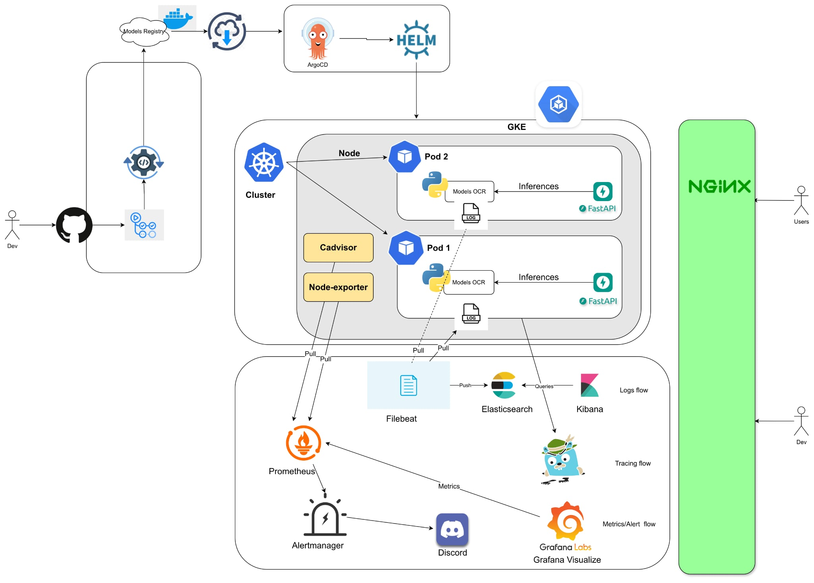

# DOC-GENAI-SYSTEM-ON-K8S

## I. System Architecture


## II. **Technology Stack**

* Source Control:   

* CI/CD: 

* Build API:   

* Containerize Application: 

* Container Orchestration: 

* K8s Package Manager: 

* Data Storage for Images: 
* Data Storage for Vector Embeddings: 
* ngress Controller: 

* Observable Tools:    
* Deliver Infrastructure as Code:  
* Cloud Platform: 
* Machine Learning: 

## III. Project Structure

```txt
Doc-GenAI-System/
├── Iac/terraform/           # Infrastructure as Code
├── helm-charts/             # Kubernetes deployments
│   ├── deploy.sh           # Main deployment script
│   ├── validate.sh         # Validation script
│   ├── ingress-nginx-app/  # Load balancer
│   ├── elasticsearch/      # Log storage
│   ├── kibana/            # Log visualization
│   ├── filebeat/          # Log collection
│   ├── prometheus/        # Metrics storage
│   ├── grafana/          # Metrics visualization
│   ├── alertmanager/     # Alert management
│   ├── node-exporter/    # Host metrics
│   ├── cadvisor/         # Container metrics
│   ├── jaeger/           # Distributed tracing
│   └── ocr-app/          # ML application
├── main.py              # OCR FastAPI service
├── requirements.txt     # Python dependencies
└── deploy-system.md     # This deployment guide
```

## IV. Table of Contents


## Create GKE Cluster

### Prerequisites
```bash
# Install tools
gcloud auth login
conda env create -f Iac/environment_ansible.yml -n deploy_system
conda activate deploy_system
```

### Deploy Infrastructure
```bash
cd Iac/terraform
terraform init
terraform plan
terraform apply -auto-approve

# Connect to cluster (replace with your values)
gcloud container clusters get-credentials dev-cluster \
    --zone asia-southeast1-a --project YOUR_PROJECT_ID


## Deploy NGINX Ingress Controller

```bash
cd ../../helm-charts/
helm upgrade --install nginx-ingress-controller ./ingress-nginx-app/ \
    -n ingress-nginx --create-namespace

# Wait for external IP
kubectl get svc -n ingress-nginx --watch


## Deploy Observability Platform

```bash
# copy your external IP of ingress-nginx then update EXTERNAL_HOST varible in ./deploy.sh 
EXTERNAL_HOST = "your_external_ip"

# Deploy all three monitoring workflows
./deploy.sh all

# This creates:
# - LOGS workflow (ELK Stack) in logging namespace
# - METRICS workflow (Prometheus Stack) in observability namespace  
# - TRACES workflow (Jaeger) in tracing namespace
```

---

## Deploy ML Application

```bash
# Deploy OCR service
helm upgrade --install ocr-app ./ocr-app/ \
    -n model-serving --create-namespace
```

---

## Verify Direct System

```bash
# Check all deployments
helm list -A
kubectl get pods --all-namespaces
kubectl get ingress -A

# Validate functionality
./validate.sh all
```

---

## 6. Access URLs

Replace `34.142.154.59.nip.io` with your external host:

### 📊 Monitoring & Observability
- **Grafana Dashboard**: http://34.142.154.59.nip.io/grafana (admin/admin)
- **Kibana Logs**: http://34.142.154.59.nip.io/kibana
- **Jaeger Tracing**: http://34.142.154.59.nip.io/jaeger
- **AlertManager**: http://34.142.154.59.nip.io/alertmanager

### 🤖 ML Application  
- **OCR Service API**: http://34.142.154.59.nip.io/ocr-app/docs
- **Health Check**: http://34.142.154.59.nip.io/ocr-app/health

### 🔒 Security Note
- **Prometheus**: Internal access only (via Grafana)
- **Default Credentials**: admin/admin

---

## 7. Troubleshooting

### Check Pod Status
```bash
kubectl get pods -n observability
kubectl get pods -n logging
kubectl get pods -n tracing
kubectl get pods -n model-serving
```

### View Logs
```bash
kubectl logs -f deployment/grafana -n observability
kubectl logs -f deployment/kibana -n logging
kubectl logs -f deployment/ocr-app -n model-serving
```

### Reset System
```bash
./deploy.sh uninstall
helm uninstall nginx-ingress-controller -n ingress-nginx
./deploy.sh all
```

### Common Issues
- **Pods not starting**: Check resources with `kubectl describe pod <pod-name>`
- **Services not accessible**: Verify ingress with `kubectl get ingress -A`
- **External IP not assigned**: Wait 2-3 minutes for cloud provider

---

## 🎯 Success Criteria

✅ GKE cluster running  
✅ NGINX ingress with external IP  
✅ All pods in Running state  
✅ Grafana accessible (metrics monitoring)  
✅ Kibana accessible (log analysis)  
✅ Jaeger accessible (distributed tracing)  
✅ OCR app accessible (ML service)  

**System is ready for production use!**

---

## Uninstallation

### For GitOps ArgoCD Deployment (Option A)

To completely remove the entire platform deployed via GitOps:

```bash
# 1. Uninstall App of Apps (removes all applications)
helm uninstall argo-apps -n argo-cd

# 2. Destroy infrastructure
cd Iac/terraform
terraform destroy -auto-approve
```

### For Direct Helm Deployment (Option B)

```bash
# 1. Uninstall all services
./deploy.sh uninstall
helm uninstall nginx-ingress-controller -n ingress-nginx
helm uninstall ocr-app -n model-serving

# 2. Destroy infrastructure
cd Iac/terraform  
terraform destroy -auto-approve
```

**Note**: GitOps approach provides cleaner uninstallation as ArgoCD manages application lifecycle automatically.